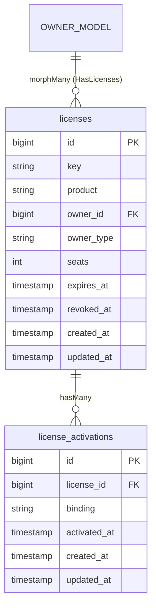

# Plan 02: Database Migrations & Eloquent Models

## Objective

Create the two database migration files (`licenses` and `license_activations`), the two Eloquent models (`License` and `Activation`), and the `HasLicenses` trait that consumers add to their `User` (or any other) model. This plan produces all data-layer code with no external dependencies on the service layer.

---

## 1. Architecture Overview



---

## 2. Migration Files

### File: `database/migrations/2024_01_01_000001_create_licenses_table.php`

```php
<?php

use Illuminate\Database\Migrations\Migration;
use Illuminate\Database\Schema\Blueprint;
use Illuminate\Support\Facades\Schema;

return new class extends Migration
{
    public function up(): void
    {
        Schema::create('licenses', function (Blueprint $table) {
            $table->id();

            // Hashed license key — indexed for fast lookup during validation.
            // Length 255 accommodates bcrypt hashes (60 chars) and future algorithms.
            $table->string('key', 255)->index();

            // The product tier or SKU this license is associated with.
            $table->string('product', 100)->index();

            // Polymorphic ownership — allows any Eloquent model to own a license.
            $table->morphs('owner'); // creates owner_id (bigint, index) + owner_type (string)

            // Maximum number of concurrent activation bindings.
            $table->unsignedInteger('seats')->default(1);

            // Nullable: when null, the license never expires.
            $table->timestamp('expires_at')->nullable()->index();

            // Nullable: when null, the license is active. Set on revocation.
            $table->timestamp('revoked_at')->nullable();

            $table->timestamps();
        });
    }

    public function down(): void
    {
        Schema::dropIfExists('licenses');
    }
};
```

### File: `database/migrations/2024_01_01_000002_create_license_activations_table.php`

```php
<?php

use Illuminate\Database\Migrations\Migration;
use Illuminate\Database\Schema\Blueprint;
use Illuminate\Support\Facades\Schema;

return new class extends Migration
{
    public function up(): void
    {
        Schema::create('license_activations', function (Blueprint $table) {
            $table->id();

            $table->foreignId('license_id')
                  ->constrained('licenses')
                  ->cascadeOnDelete();

            // The binding identifier: domain, IP, machine ID, or custom string.
            $table->string('binding', 255);

            // Explicit activation timestamp, distinct from created_at, for business logic.
            $table->timestamp('activated_at')->useCurrent();

            $table->timestamps();

            // Prevent the same binding from being activated twice on the same license.
            $table->unique(['license_id', 'binding']);
        });
    }

    public function down(): void
    {
        Schema::dropIfExists('license_activations');
    }
};
```

### Index Strategy

| Table | Column(s) | Index Type | Purpose |
|-------|-----------|------------|---------|
| `licenses` | `key` | Regular index | Fast bcrypt lookup loop during validation |
| `licenses` | `product` | Regular index | Filtering licenses by product tier |
| `licenses` | `owner_id`, `owner_type` | Composite index (via `morphs`) | Polymorphic relationship queries |
| `licenses` | `expires_at` | Regular index | Scheduled expiration queries |
| `license_activations` | `license_id` | Foreign key index | Eager loading activations |
| `license_activations` | `license_id`, `binding` | Unique composite | Prevent duplicate activations |

---

## 3. `License` Eloquent Model

### File: `src/Models/License.php`

```php
<?php

namespace DevRavik\LaravelLicensing\Models;

use Carbon\Carbon;
use DevRavik\LaravelLicensing\Contracts\LicenseContract;
use Illuminate\Database\Eloquent\Model;
use Illuminate\Database\Eloquent\Relations\HasMany;
use Illuminate\Database\Eloquent\Relations\MorphTo;

class License extends Model implements LicenseContract
{
    /**
     * The table associated with the model.
     */
    protected $table = 'licenses';

    /**
     * The attributes that are mass assignable.
     *
     * @var list<string>
     */
    protected $fillable = [
        'key',
        'product',
        'owner_id',
        'owner_type',
        'seats',
        'expires_at',
        'revoked_at',
    ];

    /**
     * The attributes that should be cast.
     *
     * @var array<string, string>
     */
    protected $casts = [
        'seats'      => 'integer',
        'expires_at' => 'datetime',
        'revoked_at' => 'datetime',
    ];

    // -------------------------------------------------------------------------
    // Relationships
    // -------------------------------------------------------------------------

    /**
     * The polymorphic owner of this license (User, Team, etc.).
     */
    public function owner(): MorphTo
    {
        return $this->morphTo();
    }

    /**
     * All activation records (seats consumed) for this license.
     */
    public function activations(): HasMany
    {
        return $this->hasMany(
            config('license.activation_model', Activation::class),
            'license_id'
        );
    }

    // -------------------------------------------------------------------------
    // Status Checks
    // -------------------------------------------------------------------------

    /**
     * Determine whether the license is currently valid (not revoked, not
     * fully expired beyond its grace window).
     */
    public function isValid(): bool
    {
        if ($this->isRevoked()) {
            return false;
        }

        if ($this->isExpired() && ! $this->isInGracePeriod()) {
            return false;
        }

        return true;
    }

    /**
     * Determine whether the license has passed its expiration date.
     */
    public function isExpired(): bool
    {
        if ($this->expires_at === null) {
            return false;
        }

        return $this->expires_at->isPast();
    }

    /**
     * Determine whether the license is expired but still within the
     * configured grace window.
     */
    public function isInGracePeriod(): bool
    {
        if (! $this->isExpired()) {
            return false;
        }

        $graceDays = (int) config('license.grace_period_days', 0);

        if ($graceDays === 0) {
            return false;
        }

        return $this->expires_at->copy()->addDays($graceDays)->isFuture();
    }

    /**
     * Determine whether the license has been revoked.
     */
    public function isRevoked(): bool
    {
        return $this->revoked_at !== null;
    }

    // -------------------------------------------------------------------------
    // Seat Calculations
    // -------------------------------------------------------------------------

    /**
     * Return the number of activation slots still available.
     */
    public function seatsRemaining(): int
    {
        $used = $this->activations()->count();

        return max(0, $this->seats - $used);
    }

    /**
     * Determine whether at least one seat is available.
     */
    public function hasAvailableSeat(): bool
    {
        return $this->seatsRemaining() > 0;
    }

    // -------------------------------------------------------------------------
    // Grace Period Helpers
    // -------------------------------------------------------------------------

    /**
     * Return the number of days remaining in the grace period, or 0.
     */
    public function graceDaysRemaining(): int
    {
        if (! $this->isInGracePeriod()) {
            return 0;
        }

        $graceDays = (int) config('license.grace_period_days', 0);
        $graceEnd  = $this->expires_at->copy()->addDays($graceDays);

        return (int) now()->diffInDays($graceEnd, false);
    }
}
```

---

## 4. `Activation` Eloquent Model

### File: `src/Models/Activation.php`

```php
<?php

namespace DevRavik\LaravelLicensing\Models;

use DevRavik\LaravelLicensing\Contracts\ActivationContract;
use Illuminate\Database\Eloquent\Model;
use Illuminate\Database\Eloquent\Relations\BelongsTo;

class Activation extends Model implements ActivationContract
{
    /**
     * The table associated with the model.
     */
    protected $table = 'license_activations';

    /**
     * The attributes that are mass assignable.
     *
     * @var list<string>
     */
    protected $fillable = [
        'license_id',
        'binding',
        'activated_at',
    ];

    /**
     * The attributes that should be cast.
     *
     * @var array<string, string>
     */
    protected $casts = [
        'activated_at' => 'datetime',
    ];

    // -------------------------------------------------------------------------
    // Relationships
    // -------------------------------------------------------------------------

    /**
     * The license that this activation belongs to.
     */
    public function license(): BelongsTo
    {
        return $this->belongsTo(
            config('license.license_model', License::class),
            'license_id'
        );
    }
}
```

---

## 5. `HasLicenses` Trait

Consumers add this trait to any Eloquent model (e.g., `User`, `Team`) to gain convenient license relationship access and query helpers.

### File: `src/Support/HasLicenses.php`

```php
<?php

namespace DevRavik\LaravelLicensing\Support;

use DevRavik\LaravelLicensing\Models\License;
use Illuminate\Database\Eloquent\Collection;
use Illuminate\Database\Eloquent\Relations\MorphMany;

trait HasLicenses
{
    /**
     * Get all licenses belonging to this model.
     */
    public function licenses(): MorphMany
    {
        return $this->morphMany(
            config('license.license_model', License::class),
            'owner'
        );
    }

    /**
     * Return all currently valid (non-revoked, non-fully-expired) licenses.
     */
    public function activeLicenses(): Collection
    {
        return $this->licenses()
            ->whereNull('revoked_at')
            ->where(function ($query) {
                $query->whereNull('expires_at')
                      ->orWhere('expires_at', '>', now());
            })
            ->get();
    }

    /**
     * Return whether the model owns any valid license for a given product.
     */
    public function hasLicenseForProduct(string $product): bool
    {
        return $this->licenses()
            ->where('product', $product)
            ->whereNull('revoked_at')
            ->where(function ($query) {
                $query->whereNull('expires_at')
                      ->orWhere('expires_at', '>', now());
            })
            ->exists();
    }
}
```

### Consumer Usage

```php
// In the consuming application's User model:
use DevRavik\LaravelLicensing\Support\HasLicenses;

class User extends Authenticatable
{
    use HasLicenses;
}

// Now available on every User instance:
$user->licenses;                          // MorphMany collection
$user->activeLicenses();                  // non-expired, non-revoked
$user->hasLicenseForProduct('pro');       // bool
```

---

## 6. Model Resolution via Config

Both the `License` model's `activations()` relationship and the `Activation` model's `license()` relationship resolve the model class through `config()`:

```php
// In License::activations()
config('license.activation_model', Activation::class)

// In Activation::license()
config('license.license_model', License::class)
```

This means a consumer can swap models in `config/license.php` and the entire package respects the override without any code changes — the same pattern used by `spatie/laravel-permission`.

---

## 7. Execution Checklist

- [ ] Create `database/migrations/2024_01_01_000001_create_licenses_table.php`
- [ ] Create `database/migrations/2024_01_01_000002_create_license_activations_table.php`
- [ ] Verify all indexes are present (key, product, morphs, expires_at, unique composite)
- [ ] Create `src/Models/License.php` with all status/seat methods
- [ ] Create `src/Models/Activation.php` with `license()` relationship
- [ ] Create `src/Support/HasLicenses.php` with `licenses()`, `activeLicenses()`, `hasLicenseForProduct()`
- [ ] Verify both models implement their respective contracts (Plan 03 defines the interfaces)
- [ ] Confirm `config()` resolution in relationships uses the correct config keys
- [ ] Run `php artisan migrate` against a test database to confirm schema is valid
- [ ] Write smoke test: create a License record and eager-load activations

---

## 8. Dependencies Between Plans

| Depends On | What Is Needed |
|-----------|----------------|
| Plan 01 | Directory structure and `composer.json` autoloading must exist |
| Plan 03 | `LicenseContract` and `ActivationContract` interfaces (models implement them) |

| Enables | What This Plan Provides |
|---------|------------------------|
| Plan 04 | `LicenseBuilder` persists to the `licenses` table via the `License` model |
| Plan 05 | `LicenseManager` queries and updates `License` and `Activation` records |
| Plan 08 | Events carry `License` and `Activation` model instances as payloads |
| Plan 09 | Middleware queries `License` model to resolve product and validity |
| Plan 10 | All feature tests use `RefreshDatabase` against these migration files |
