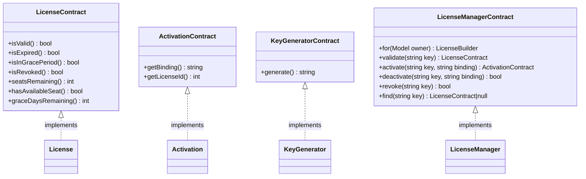

# Plan 03: Contracts & Interfaces

## Objective

Define every PHP interface (contract) that the package exposes. Contracts serve as the formal API contract between the package internals and any consumer who wants to swap out a model, service, or key-generation strategy. This is the pattern used by `spatie/laravel-permission` and other professional packages: concrete classes implement contracts, and the service container binds concrete classes to contract type-hints.

---

## 1. Why Contracts Matter for a Published Package

| Benefit | Explanation |
|---------|-------------|
| **Replaceability** | Consumers can bind their own implementations without forking the package |
| **Testability** | Contracts make mocking trivial in consumer test suites |
| **Documentation** | Interfaces serve as machine-readable documentation of the public API |
| **Stability** | Interfaces can be versioned independently; implementation details can change without breaking the contract |

---

## 2. Contract Inventory



---

## 3. Contract Files

### File: `src/Contracts/LicenseContract.php`

Defines the complete read-only API for a license model. The `License` Eloquent model (Plan 02) implements this interface. Consumers can also implement it on a completely custom model.

```php
<?php

namespace DevRavik\LaravelLicensing\Contracts;

/**
 * Defines the required API for a license model.
 *
 * Any class implementing this contract can be used as the license_model
 * in config/license.php without modifying any package internals.
 */
interface LicenseContract
{
    /**
     * Determine whether the license is currently valid.
     *
     * A valid license is one that:
     *   - has not been revoked
     *   - has not expired beyond its grace period
     *
     * @return bool
     */
    public function isValid(): bool;

    /**
     * Determine whether the license has passed its expiration date.
     *
     * A license with a null expires_at is considered never-expiring
     * and should always return false from this method.
     *
     * @return bool
     */
    public function isExpired(): bool;

    /**
     * Determine whether the license is expired but still within
     * the configured grace window (grace_period_days).
     *
     * Returns false if grace periods are disabled (grace_period_days = 0)
     * or if the license is not expired.
     *
     * @return bool
     */
    public function isInGracePeriod(): bool;

    /**
     * Determine whether the license has been revoked.
     *
     * @return bool
     */
    public function isRevoked(): bool;

    /**
     * Return the number of activation seats still available.
     *
     * @return int
     */
    public function seatsRemaining(): int;

    /**
     * Determine whether at least one seat is available.
     *
     * @return bool
     */
    public function hasAvailableSeat(): bool;

    /**
     * Return the number of days remaining in the grace period.
     *
     * Returns 0 if the license is not in a grace period.
     *
     * @return int
     */
    public function graceDaysRemaining(): int;
}
```

---

### File: `src/Contracts/ActivationContract.php`

Defines the required API for an activation record. The `Activation` Eloquent model (Plan 02) implements this interface.

```php
<?php

namespace DevRavik\LaravelLicensing\Contracts;

/**
 * Defines the required API for an activation (seat binding) model.
 *
 * Any class implementing this contract can be used as the activation_model
 * in config/license.php without modifying any package internals.
 */
interface ActivationContract
{
    /**
     * Return the binding identifier for this activation.
     *
     * Examples: 'app.example.com', '203.0.113.42', 'hw-uuid-abc123'
     *
     * @return string
     */
    public function getBinding(): string;

    /**
     * Return the primary key of the license this activation belongs to.
     *
     * @return int
     */
    public function getLicenseId(): int;
}
```

---

### File: `src/Contracts/KeyGeneratorContract.php`

Decouples key generation from the rest of the package. The default implementation uses `random_bytes()`. Consumers could swap in a UUID-based generator, a formatted key generator (e.g. `XXXX-XXXX-XXXX-XXXX`), or a HSM-backed generator.

```php
<?php

namespace DevRavik\LaravelLicensing\Contracts;

/**
 * Defines the contract for generating raw license key strings.
 *
 * The returned string is the plaintext key — it is hashed by the
 * LicenseManager before being stored if hash_keys is enabled.
 */
interface KeyGeneratorContract
{
    /**
     * Generate a new cryptographically secure license key string.
     *
     * The returned key must contain only printable ASCII characters
     * suitable for display and transmission over HTTP.
     *
     * @param  int  $length  Number of characters in the generated key.
     * @return string        The raw (unhashed) license key.
     */
    public function generate(int $length): string;
}
```

---

### File: `src/Contracts/LicenseManagerContract.php`

The top-level service contract. The `License` facade (Plan 06) proxies to an implementation of this interface. Consumers can bind their own `LicenseManager` in the service container for full control over business logic.

```php
<?php

namespace DevRavik\LaravelLicensing\Contracts;

use DevRavik\LaravelLicensing\LicenseBuilder;
use Illuminate\Database\Eloquent\Model;

/**
 * Defines the primary API for all license management operations.
 *
 * This is the contract resolved when the License facade is used:
 *   License::for($user)->product('pro')->create();
 *   License::validate($key);
 */
interface LicenseManagerContract
{
    /**
     * Begin building a new license for the given owner model.
     *
     * @param  Model  $owner  Any Eloquent model (User, Team, etc.)
     * @return LicenseBuilder
     */
    public function for(Model $owner): LicenseBuilder;

    /**
     * Validate a license key and return the corresponding license instance.
     *
     * Throws an exception if the key is invalid, expired, or revoked.
     *
     * @param  string  $key  The raw (unhashed) license key.
     * @return LicenseContract
     *
     * @throws \DevRavik\LaravelLicensing\Exceptions\InvalidLicenseException
     * @throws \DevRavik\LaravelLicensing\Exceptions\LicenseExpiredException
     * @throws \DevRavik\LaravelLicensing\Exceptions\LicenseRevokedException
     */
    public function validate(string $key): LicenseContract;

    /**
     * Activate a license against an identifier (domain, IP, machine ID).
     *
     * @param  string  $key      The raw license key.
     * @param  string  $binding  The identifier to bind the activation to.
     * @return ActivationContract
     *
     * @throws \DevRavik\LaravelLicensing\Exceptions\InvalidLicenseException
     * @throws \DevRavik\LaravelLicensing\Exceptions\SeatLimitExceededException
     * @throws \DevRavik\LaravelLicensing\Exceptions\LicenseAlreadyActivatedException
     */
    public function activate(string $key, string $binding): ActivationContract;

    /**
     * Remove an activation binding from a license, freeing the seat.
     *
     * @param  string  $key      The raw license key.
     * @param  string  $binding  The binding identifier to remove.
     * @return bool   True on success, false if binding was not found.
     *
     * @throws \DevRavik\LaravelLicensing\Exceptions\InvalidLicenseException
     */
    public function deactivate(string $key, string $binding): bool;

    /**
     * Permanently revoke a license.
     *
     * All subsequent validate() or activate() calls on this key will fail.
     *
     * @param  string  $key  The raw license key.
     * @return bool
     *
     * @throws \DevRavik\LaravelLicensing\Exceptions\InvalidLicenseException
     */
    public function revoke(string $key): bool;

    /**
     * Find a license by its raw key without performing any validation.
     *
     * Returns null if the key does not match any record.
     *
     * @param  string  $key  The raw license key.
     * @return LicenseContract|null
     */
    public function find(string $key): ?LicenseContract;
}
```

---

## 4. How Contracts Wire Into the Container

In `LicenseServiceProvider` (Plan 06), the container bindings will look like this:

```php
// Bind the key generator contract to the concrete implementation.
// Consumers can override this binding in their own service provider.
$this->app->bind(
    \DevRavik\LaravelLicensing\Contracts\KeyGeneratorContract::class,
    \DevRavik\LaravelLicensing\KeyGenerator::class
);

// Bind the license manager contract to the concrete implementation.
// The License facade resolves through this binding.
$this->app->singleton(
    \DevRavik\LaravelLicensing\Contracts\LicenseManagerContract::class,
    \DevRavik\LaravelLicensing\LicenseManager::class
);
```

### Consumer Override Example

```php
// In a consumer's AppServiceProvider::register():
$this->app->bind(
    \DevRavik\LaravelLicensing\Contracts\KeyGeneratorContract::class,
    \App\Services\FormattedKeyGenerator::class  // XXXX-XXXX-XXXX-XXXX format
);
```

---

## 5. Implementing Contracts on the Eloquent Models

The `License` and `Activation` models must implement their contracts. The two methods that do not map directly to Eloquent attributes require concrete implementations:

### `ActivationContract` methods on `Activation` model

```php
// In src/Models/Activation.php

public function getBinding(): string
{
    return $this->binding;
}

public function getLicenseId(): int
{
    return (int) $this->license_id;
}
```

These accessor methods provide a stable API surface even if the underlying column names change in a future major version.

---

## 6. Execution Checklist

- [ ] Create `src/Contracts/LicenseContract.php` with all 7 method signatures + docblocks
- [ ] Create `src/Contracts/ActivationContract.php` with `getBinding()` and `getLicenseId()`
- [ ] Create `src/Contracts/KeyGeneratorContract.php` with `generate(int $length): string`
- [ ] Create `src/Contracts/LicenseManagerContract.php` with all 6 method signatures
- [ ] Add `implements LicenseContract` to `src/Models/License.php` (Plan 02)
- [ ] Add `implements ActivationContract` to `src/Models/Activation.php` and add the two accessor methods
- [ ] Confirm all `@throws` docblocks reference the correct exception namespaces (Plan 07)
- [ ] Ensure `LicenseManagerContract` type-hints `LicenseBuilder` — this is an intentional concrete type (builders are not typically contracted)

---

## 7. Dependencies Between Plans

| Depends On | What Is Needed |
|-----------|----------------|
| Plan 01 | `src/Contracts/` directory must exist |
| Plan 02 | `License` and `Activation` models exist to implement the contracts |

| Enables | What This Plan Provides |
|---------|------------------------|
| Plan 04 | `LicenseBuilder` calls `LicenseManagerContract` internally |
| Plan 05 | `LicenseManager` implements `LicenseManagerContract` |
| Plan 06 | Service provider binds contracts to concrete classes in the IoC container |
| Plan 07 | Exception `@throws` annotations reference contracts as return types |
