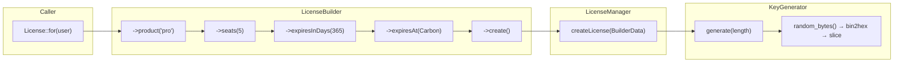

# Plan 04: KeyGenerator & LicenseBuilder

## Objective

Implement two focused classes:
1. **`KeyGenerator`** — generates cryptographically secure raw license key strings.
2. **`LicenseBuilder`** — a fluent builder that collects license parameters and persists a new `License` record, returning the model with the raw key temporarily attached.

Both classes are pure PHP with no HTTP or database side-effects of their own; all database interaction flows through the `LicenseManager` (Plan 05).

---

## 1. Responsibility Breakdown



---

## 2. `KeyGenerator`

### File: `src/KeyGenerator.php`

```php
<?php

namespace DevRavik\LaravelLicensing;

use DevRavik\LaravelLicensing\Contracts\KeyGeneratorContract;

/**
 * Generates cryptographically secure license key strings using PHP's
 * random_bytes() function, which reads from the OS CSPRNG.
 *
 * The output is a lowercase hexadecimal string. 32 hex characters
 * represent 128 bits of entropy, which is sufficient for license keys
 * and is consistent with UUID security levels.
 */
class KeyGenerator implements KeyGeneratorContract
{
    /**
     * Generate a secure random license key of the given character length.
     *
     * @param  int  $length  Number of hex characters in the output key.
     *                       Must be between 16 and 128.
     * @return string        Lowercase hex string of the requested length.
     *
     * @throws \InvalidArgumentException if length is out of the acceptable range.
     */
    public function generate(int $length): string
    {
        if ($length < 16 || $length > 128) {
            throw new \InvalidArgumentException(
                "License key length must be between 16 and 128. Got: {$length}."
            );
        }

        // We need ceil($length / 2) bytes to produce $length hex characters.
        // bin2hex() converts each byte to two hex chars, so we truncate to
        // the exact requested length.
        $bytesNeeded = (int) ceil($length / 2);
        $hex = bin2hex(random_bytes($bytesNeeded));

        return substr($hex, 0, $length);
    }
}
```

### Why `random_bytes()` + `bin2hex()`?

| Property | Detail |
|----------|--------|
| **Entropy source** | `random_bytes()` reads from `/dev/urandom` on Linux, `CryptGenRandom` on Windows — OS-level CSPRNG |
| **Output alphabet** | Hex (`0-9a-f`) is safe for all transports, URLs, and display contexts |
| **No external dependencies** | No OpenSSL extension required (PHP 7+ has `random_bytes` built-in) |
| **Deterministic length** | `substr(bin2hex(...), 0, $length)` always returns exactly `$length` characters |

### Alternative: Formatted Keys

If a consumer wants formatted keys like `XXXX-XXXX-XXXX-XXXX`, they can implement `KeyGeneratorContract` themselves:

```php
class FormattedKeyGenerator implements KeyGeneratorContract
{
    public function generate(int $length): string
    {
        // Group hex chars into chunks of 4, separated by dashes.
        $raw = bin2hex(random_bytes((int) ceil($length / 2)));
        $raw = strtoupper(substr($raw, 0, $length));
        return implode('-', str_split($raw, 4));
    }
}
```

---

## 3. `LicenseBuilder`

### File: `src/LicenseBuilder.php`

```php
<?php

namespace DevRavik\LaravelLicensing;

use Carbon\Carbon;
use DevRavik\LaravelLicensing\Contracts\LicenseContract;
use Illuminate\Database\Eloquent\Model;

/**
 * Fluent builder for constructing and persisting a new license.
 *
 * Usage:
 *   License::for($user)
 *       ->product('pro')
 *       ->seats(5)
 *       ->expiresInDays(365)
 *       ->create();
 */
class LicenseBuilder
{
    /**
     * The owner model this license will be associated with.
     */
    protected Model $owner;

    /**
     * The product name or tier identifier.
     */
    protected ?string $product = null;

    /**
     * Maximum number of concurrent activations.
     */
    protected int $seats = 1;

    /**
     * Explicit expiration date/time, or null for "use config default".
     */
    protected ?Carbon $expiresAt = null;

    /**
     * @param  Model           $owner    The owner model.
     * @param  LicenseManager  $manager  The manager instance that will persist the license.
     */
    public function __construct(
        Model $owner,
        protected LicenseManager $manager
    ) {
        $this->owner = $owner;
    }

    // -------------------------------------------------------------------------
    // Builder Methods
    // -------------------------------------------------------------------------

    /**
     * Set the product name or tier for this license.
     *
     * @param  string  $product  E.g. 'basic', 'pro', 'enterprise'
     */
    public function product(string $product): static
    {
        $this->product = $product;

        return $this;
    }

    /**
     * Set the maximum number of concurrent activation bindings.
     *
     * @param  int  $count  Must be >= 1.
     */
    public function seats(int $count): static
    {
        if ($count < 1) {
            throw new \InvalidArgumentException(
                "Seat count must be at least 1. Got: {$count}."
            );
        }

        $this->seats = $count;

        return $this;
    }

    /**
     * Set the expiration to $days days from now.
     *
     * @param  int  $days  Number of days from the current time. Must be >= 1.
     */
    public function expiresInDays(int $days): static
    {
        if ($days < 1) {
            throw new \InvalidArgumentException(
                "Expiry days must be at least 1. Got: {$days}."
            );
        }

        $this->expiresAt = now()->addDays($days);

        return $this;
    }

    /**
     * Set an explicit expiration Carbon date/time.
     *
     * @param  Carbon  $date  Must be in the future.
     */
    public function expiresAt(Carbon $date): static
    {
        if ($date->isPast()) {
            throw new \InvalidArgumentException(
                'Expiration date must be in the future.'
            );
        }

        $this->expiresAt = $date;

        return $this;
    }

    // -------------------------------------------------------------------------
    // Terminal Method
    // -------------------------------------------------------------------------

    /**
     * Persist the license and return the model instance.
     *
     * The returned model has a transient `rawKey` attribute attached
     * that holds the plaintext key. This attribute is NOT stored in the
     * database and will NOT be present on any subsequent retrieval.
     *
     * @return LicenseContract  The persisted license model with rawKey set.
     *
     * @throws \InvalidArgumentException if product has not been set.
     */
    public function create(): LicenseContract
    {
        if ($this->product === null) {
            throw new \InvalidArgumentException(
                'A product must be set before calling create(). Use ->product("name").'
            );
        }

        // Resolve expiration: use builder value, or fall back to config default.
        $expiresAt = $this->expiresAt;

        if ($expiresAt === null) {
            $defaultDays = config('license.default_expiry_days');
            if ($defaultDays !== null) {
                $expiresAt = now()->addDays((int) $defaultDays);
            }
        }

        return $this->manager->createLicense(
            owner:     $this->owner,
            product:   $this->product,
            seats:     $this->seats,
            expiresAt: $expiresAt,
        );
    }

    // -------------------------------------------------------------------------
    // Inspection Helpers (for testing or logging)
    // -------------------------------------------------------------------------

    /**
     * Return the current builder state as an array.
     * Useful for debugging and logging during development.
     *
     * @return array<string, mixed>
     */
    public function toArray(): array
    {
        return [
            'owner_type' => get_class($this->owner),
            'owner_id'   => $this->owner->getKey(),
            'product'    => $this->product,
            'seats'      => $this->seats,
            'expires_at' => $this->expiresAt?->toIso8601String(),
        ];
    }
}
```

---

## 4. Raw Key on the Model Instance

A key design decision: the raw (plaintext) license key must be accessible to the caller immediately after `create()` but must never be stored in the database (only the hash is stored). The cleanest approach is to attach it as a non-persisted attribute on the model instance:

```php
// In LicenseManager::createLicense() (Plan 05):
$license = new License();
$license->key = Hash::make($rawKey);   // hashed — written to DB
// ...
$license->save();
$license->key = $rawKey;               // raw key — overwrites only in memory
// $license->wasRecentlyCreated === true
return $license;
```

The consumer then accesses it as:
```php
$license = License::for($user)->product('pro')->create();
$rawKey  = $license->key; // plaintext — available once, never in DB
```

After this, if the consumer calls `$license->fresh()`, `$license->key` will return the hashed value from the database. This behavior must be documented clearly.

---

## 5. Expiration Resolution Logic

```mermaid
flowchart TD
    A[create() called] --> B{expiresAt set\non builder?}
    B -- Yes --> E[Use builder expiresAt]
    B -- No --> C{config default_expiry_days\nis not null?}
    C -- Yes --> D["expiresAt = now() + default_expiry_days"]
    C -- No --> F[expiresAt = null — never expires]
    D --> G[Pass to LicenseManager::createLicense]
    E --> G
    F --> G
```

---

## 6. Fluent Method Chain Validation

The builder validates its inputs eagerly in each setter:

| Method | Validation | Exception |
|--------|-----------|-----------|
| `seats(int $count)` | `$count >= 1` | `\InvalidArgumentException` |
| `expiresInDays(int $days)` | `$days >= 1` | `\InvalidArgumentException` |
| `expiresAt(Carbon $date)` | `$date` is in the future | `\InvalidArgumentException` |
| `create()` | `$product` is not null | `\InvalidArgumentException` |

Using standard `\InvalidArgumentException` (rather than a custom exception) for builder configuration errors keeps the exception handling surface clean — these are programmer errors, not runtime business logic failures.

---

## 7. Execution Checklist

- [ ] Create `src/KeyGenerator.php` implementing `KeyGeneratorContract`
- [ ] Validate that `random_bytes()` is available (PHP 7+ built-in, no extension needed)
- [ ] Write `KeyGeneratorTest` to verify output length and uniqueness (Plan 10)
- [ ] Create `src/LicenseBuilder.php` with all 5 public methods
- [ ] Implement eager validation in each setter method
- [ ] Implement `create()` terminal method with expiration fallback logic
- [ ] Confirm `create()` delegates to `LicenseManager::createLicense()` (Plan 05)
- [ ] Confirm the returned model has the raw key set as an in-memory attribute

---

## 8. Dependencies Between Plans

| Depends On | What Is Needed |
|-----------|----------------|
| Plan 01 | `src/` directory and autoloading configured |
| Plan 03 | `KeyGeneratorContract` and `LicenseManagerContract` interfaces defined |

| Enables | What This Plan Provides |
|---------|------------------------|
| Plan 05 | `LicenseManager::for()` returns a `LicenseBuilder` instance |
| Plan 06 | Service provider binds `KeyGeneratorContract` to `KeyGenerator` |
| Plan 10 | Unit tests for `KeyGenerator` and `LicenseBuilder` |
