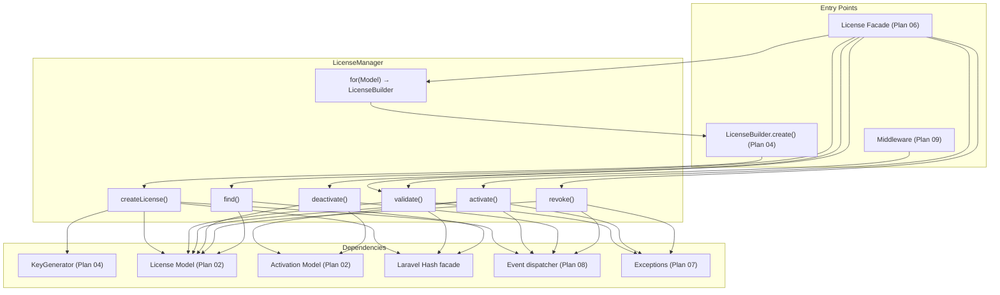

# Plan 05: LicenseManager Service

## Objective

Implement `LicenseManager` — the core orchestration class of the package. It implements `LicenseManagerContract` and is responsible for all license lifecycle operations: creation, validation, activation, deactivation, revocation, and key lookup. All database writes, hash operations, and event dispatching flow through this single service.

---

## 1. Responsibility Map



---

## 2. `LicenseManager` Full Implementation

### File: `src/LicenseManager.php`

```php
<?php

namespace DevRavik\LaravelLicensing;

use Carbon\Carbon;
use DevRavik\LaravelLicensing\Contracts\ActivationContract;
use DevRavik\LaravelLicensing\Contracts\KeyGeneratorContract;
use DevRavik\LaravelLicensing\Contracts\LicenseContract;
use DevRavik\LaravelLicensing\Contracts\LicenseManagerContract;
use DevRavik\LaravelLicensing\Events\LicenseActivated;
use DevRavik\LaravelLicensing\Events\LicenseCreated;
use DevRavik\LaravelLicensing\Events\LicenseDeactivated;
use DevRavik\LaravelLicensing\Events\LicenseRevoked;
use DevRavik\LaravelLicensing\Exceptions\InvalidLicenseException;
use DevRavik\LaravelLicensing\Exceptions\LicenseAlreadyActivatedException;
use DevRavik\LaravelLicensing\Exceptions\LicenseExpiredException;
use DevRavik\LaravelLicensing\Exceptions\LicenseRevokedException;
use DevRavik\LaravelLicensing\Exceptions\SeatLimitExceededException;
use Illuminate\Contracts\Events\Dispatcher;
use Illuminate\Contracts\Hashing\Hasher;
use Illuminate\Database\Eloquent\Model;

class LicenseManager implements LicenseManagerContract
{
    public function __construct(
        protected KeyGeneratorContract $keyGenerator,
        protected Hasher $hasher,
        protected Dispatcher $events,
    ) {}

    // -------------------------------------------------------------------------
    // Builder Entry Point
    // -------------------------------------------------------------------------

    /**
     * Begin building a new license for the given owner model.
     */
    public function for(Model $owner): LicenseBuilder
    {
        return new LicenseBuilder($owner, $this);
    }

    // -------------------------------------------------------------------------
    // Create
    // -------------------------------------------------------------------------

    /**
     * Persist a new license record and return the model with the raw key set.
     *
     * Called internally by LicenseBuilder::create(). Not exposed on the facade
     * directly — consumers always go through the builder.
     *
     * @internal
     */
    public function createLicense(
        Model $owner,
        string $product,
        int $seats,
        ?Carbon $expiresAt,
    ): LicenseContract {
        $keyLength = (int) config('license.key_length', 32);
        $rawKey    = $this->keyGenerator->generate($keyLength);

        $licenseModelClass = config('license.license_model');

        /** @var \DevRavik\LaravelLicensing\Models\License $license */
        $license = new $licenseModelClass();
        $license->product    = $product;
        $license->seats      = $seats;
        $license->expires_at = $expiresAt;
        $license->revoked_at = null;

        // Associate the polymorphic owner.
        $license->owner()->associate($owner);

        // Hash the key before persisting if hash_keys is enabled.
        $shouldHash = (bool) config('license.hash_keys', true);
        $license->key = $shouldHash ? $this->hasher->make($rawKey) : $rawKey;

        $license->save();

        // Temporarily overwrite the key attribute with the raw value so the
        // caller can read it once. This value is NOT persisted.
        $license->key = $rawKey;

        $this->events->dispatch(new LicenseCreated($license));

        return $license;
    }

    // -------------------------------------------------------------------------
    // Validate
    // -------------------------------------------------------------------------

    /**
     * Validate a raw license key and return the license if valid.
     *
     * @throws InvalidLicenseException   If the key does not match any record.
     * @throws LicenseRevokedException   If the license has been revoked.
     * @throws LicenseExpiredException   If the license is expired beyond grace.
     */
    public function validate(string $key): LicenseContract
    {
        $license = $this->findByKey($key);

        if ($license === null) {
            throw InvalidLicenseException::forKey($key);
        }

        if ($license->isRevoked()) {
            throw LicenseRevokedException::forLicense($license);
        }

        if ($license->isExpired() && ! $license->isInGracePeriod()) {
            throw LicenseExpiredException::forLicense($license);
        }

        return $license;
    }

    // -------------------------------------------------------------------------
    // Activate
    // -------------------------------------------------------------------------

    /**
     * Activate a license against a binding identifier, consuming one seat.
     *
     * @throws InvalidLicenseException         If the key is not valid.
     * @throws LicenseRevokedException         If the license is revoked.
     * @throws LicenseExpiredException         If the license is expired.
     * @throws SeatLimitExceededException      If no seats remain.
     * @throws LicenseAlreadyActivatedException If the binding already exists.
     */
    public function activate(string $key, string $binding): ActivationContract
    {
        // Validate first — throws on invalid/expired/revoked.
        $license = $this->validate($key);

        $activationModelClass = config('license.activation_model');

        // Check for duplicate binding.
        $existing = $license->activations()
            ->where('binding', $binding)
            ->first();

        if ($existing !== null) {
            throw LicenseAlreadyActivatedException::forBinding($license, $binding);
        }

        // Check seat availability.
        if (! $license->hasAvailableSeat()) {
            throw SeatLimitExceededException::forLicense($license);
        }

        /** @var \DevRavik\LaravelLicensing\Models\Activation $activation */
        $activation = new $activationModelClass();
        $activation->license_id   = $license->getKey();
        $activation->binding      = $binding;
        $activation->activated_at = now();
        $activation->save();

        $this->events->dispatch(new LicenseActivated($license, $activation));

        return $activation;
    }

    // -------------------------------------------------------------------------
    // Deactivate
    // -------------------------------------------------------------------------

    /**
     * Remove an activation binding from a license, freeing the seat.
     *
     * Returns true if the binding was found and deleted, false otherwise.
     *
     * @throws InvalidLicenseException If the key is not found.
     */
    public function deactivate(string $key, string $binding): bool
    {
        $license = $this->findByKey($key);

        if ($license === null) {
            throw InvalidLicenseException::forKey($key);
        }

        $activation = $license->activations()
            ->where('binding', $binding)
            ->first();

        if ($activation === null) {
            return false;
        }

        $activation->delete();

        $this->events->dispatch(new LicenseDeactivated($license, $binding));

        return true;
    }

    // -------------------------------------------------------------------------
    // Revoke
    // -------------------------------------------------------------------------

    /**
     * Permanently revoke a license by setting its revoked_at timestamp.
     *
     * @throws InvalidLicenseException If the key is not found.
     */
    public function revoke(string $key): bool
    {
        $license = $this->findByKey($key);

        if ($license === null) {
            throw InvalidLicenseException::forKey($key);
        }

        $license->revoked_at = now();
        $license->save();

        $this->events->dispatch(new LicenseRevoked($license));

        return true;
    }

    // -------------------------------------------------------------------------
    // Find (no validation)
    // -------------------------------------------------------------------------

    /**
     * Find a license by raw key without throwing on failure.
     *
     * Returns null if no matching license is found.
     */
    public function find(string $key): ?LicenseContract
    {
        return $this->findByKey($key);
    }

    // -------------------------------------------------------------------------
    // Internal Key Lookup
    // -------------------------------------------------------------------------

    /**
     * Scan the licenses table and compare the raw key against stored values.
     *
     * When hash_keys is true: iterates all non-revoked records and uses
     * Hash::check() (bcrypt comparison). This is the same pattern used by
     * Laravel's authentication system for password lookup.
     *
     * When hash_keys is false: performs a direct DB equality check.
     *
     * PERFORMANCE NOTE: For large license tables, consider caching the
     * hash lookup or adding a separate lookup_token column (a fast SHA-256
     * hash) indexed in the DB alongside the secure bcrypt hash. See the
     * Roadmap in README for planned optimizations.
     *
     * @return \DevRavik\LaravelLicensing\Models\License|null
     */
    protected function findByKey(string $rawKey): ?LicenseContract
    {
        $licenseModelClass = config('license.license_model');
        $shouldHash        = (bool) config('license.hash_keys', true);

        if (! $shouldHash) {
            return $licenseModelClass::where('key', $rawKey)->first();
        }

        // For hashed keys: iterate all licenses and use Hash::check().
        // This is intentionally O(n) per lookup. The Roadmap section of the
        // README discusses SHA-256 lookup tokens as a planned optimization
        // to bring this to O(log n) without storing plaintext keys.
        foreach ($licenseModelClass::cursor() as $license) {
            if ($this->hasher->check($rawKey, $license->key)) {
                return $license;
            }
        }

        return null;
    }
}
```

---

## 3. `LicenseValidator` — Extracted Validation Logic

While the `LicenseManager` is the primary service, extracting the validation logic into a dedicated `LicenseValidator` class keeps validation independently testable and follows the single-responsibility principle.

### File: `src/LicenseValidator.php`

```php
<?php

namespace DevRavik\LaravelLicensing;

use DevRavik\LaravelLicensing\Contracts\LicenseContract;
use DevRavik\LaravelLicensing\Exceptions\LicenseExpiredException;
use DevRavik\LaravelLicensing\Exceptions\LicenseRevokedException;

/**
 * Validates the business state of a resolved license model.
 *
 * This class is used internally by LicenseManager after the license has
 * been located by key. It does NOT perform key lookup — that is the
 * LicenseManager's responsibility.
 */
class LicenseValidator
{
    /**
     * Assert that a resolved license is in a valid state.
     *
     * @throws LicenseRevokedException
     * @throws LicenseExpiredException
     */
    public function assertValid(LicenseContract $license): void
    {
        if ($license->isRevoked()) {
            throw LicenseRevokedException::forLicense($license);
        }

        if ($license->isExpired() && ! $license->isInGracePeriod()) {
            throw LicenseExpiredException::forLicense($license);
        }
    }

    /**
     * Check validity without throwing — returns bool.
     */
    public function isValid(LicenseContract $license): bool
    {
        try {
            $this->assertValid($license);
            return true;
        } catch (\Throwable) {
            return false;
        }
    }
}
```

---

## 4. Key Lookup Strategy — Detailed Discussion

The bcrypt key lookup strategy has an important performance implication that must be documented and addressed:

### Current Strategy (v1.0)

```
findByKey(rawKey):
  foreach license in licenses.cursor():
    if Hash::check(rawKey, license.key):
      return license
  return null
```

**Cost:** bcrypt hash check is deliberately slow (~100ms per check at cost=10). With 10,000 licenses, worst-case lookup is 1,000 seconds — unacceptable in production.

### Recommended Optimization (v1.1 Roadmap)

Add a `lookup_token` column: a fast SHA-256 hash of the raw key, indexed for O(1) DB lookup. The bcrypt hash remains for security. The lookup flow becomes:

```
lookup_token = hash('sha256', rawKey)
license = licenses.where('lookup_token', lookup_token).first()
if license and Hash::check(rawKey, license.key):
  return license
```

This brings lookup to O(1) while maintaining the security of bcrypt storage. The README Roadmap section references this.

### For v1.0 (this plan)

Document the limitation clearly. Add a note in config recommending consumers use this package for applications with < 10,000 licenses, or implement caching on top.

---

## 5. Execution Checklist

- [ ] Create `src/LicenseManager.php` implementing `LicenseManagerContract`
- [ ] Implement `for()` → returns `LicenseBuilder` with `$this` passed as manager
- [ ] Implement `createLicense()` using `KeyGenerator`, `Hash`, model classes from config
- [ ] Implement raw key temporary attachment after `$license->save()`
- [ ] Implement `validate()` with ordered exception checks (revoked before expired)
- [ ] Implement `activate()` with duplicate-binding check before seat-limit check
- [ ] Implement `deactivate()` returning bool
- [ ] Implement `revoke()` setting `revoked_at = now()`
- [ ] Implement `find()` wrapping `findByKey()` (no exception on null)
- [ ] Implement `findByKey()` with hash/plaintext branching
- [ ] Create `src/LicenseValidator.php` with `assertValid()` and `isValid()` methods
- [ ] Inject all dependencies via constructor (KeyGeneratorContract, Hasher, Dispatcher)
- [ ] Document bcrypt key lookup performance limitation and the v1.1 lookup_token roadmap

---

## 6. Dependencies Between Plans

| Depends On | What Is Needed |
|-----------|----------------|
| Plan 02 | `License` and `Activation` Eloquent models |
| Plan 03 | All four contracts that LicenseManager depends on and implements |
| Plan 04 | `LicenseBuilder` (returned by `for()`), `KeyGenerator` (injected) |
| Plan 07 | All exception classes used in `validate()`, `activate()`, `revoke()` |
| Plan 08 | Event classes dispatched after each mutation (LicenseCreated, etc.) |

| Enables | What This Plan Provides |
|---------|------------------------|
| Plan 06 | Service provider instantiates `LicenseManager` as a singleton |
| Plan 09 | Middleware calls `LicenseManager::validate()` |
| Plan 10 | Feature tests drive all behavior through `LicenseManager` via the facade |
