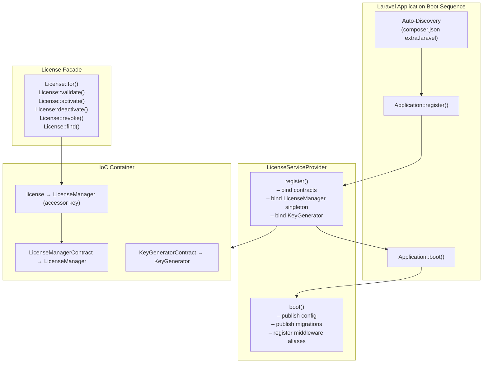

# Plan 06: Facade & Service Provider

## Objective

Implement `LicenseServiceProvider` and the `License` Facade. The service provider is the package's boot entry point — it registers all container bindings, publishes config/migrations, and makes the package self-discoverable via `composer.json`. The facade provides the clean static API (`License::for()`, `License::validate()`, etc.) that consumers use throughout their applications.

---

## 1. Component Overview



---

## 2. `LicenseServiceProvider`

### File: `src/LicenseServiceProvider.php`

```php
<?php

namespace DevRavik\LaravelLicensing;

use DevRavik\LaravelLicensing\Contracts\KeyGeneratorContract;
use DevRavik\LaravelLicensing\Contracts\LicenseManagerContract;
use DevRavik\LaravelLicensing\Http\Middleware\CheckLicense;
use DevRavik\LaravelLicensing\Http\Middleware\CheckValidLicense;
use Illuminate\Routing\Router;
use Illuminate\Support\ServiceProvider;

class LicenseServiceProvider extends ServiceProvider
{
    /**
     * All package assets available for publishing.
     */
    private const TAG_CONFIG     = 'license-config';
    private const TAG_MIGRATIONS = 'license-migrations';

    // -------------------------------------------------------------------------
    // Register
    // -------------------------------------------------------------------------

    /**
     * Register package bindings into the Laravel IoC container.
     */
    public function register(): void
    {
        // Merge the package config so consumers can use config('license.*')
        // even before they publish the config file.
        $this->mergeConfigFrom(
            __DIR__ . '/../config/license.php',
            'license'
        );

        // Bind the key generator — swappable by consumers.
        $this->app->bind(
            KeyGeneratorContract::class,
            KeyGenerator::class
        );

        // Bind the license manager as a singleton — one instance per request.
        // Consumers can override this binding in their own AppServiceProvider.
        $this->app->singleton(
            LicenseManagerContract::class,
            function ($app) {
                return new LicenseManager(
                    keyGenerator: $app->make(KeyGeneratorContract::class),
                    hasher:       $app['hash'],
                    events:       $app['events'],
                );
            }
        );

        // Register a short accessor key so the facade can resolve it.
        $this->app->alias(LicenseManagerContract::class, 'license');
    }

    // -------------------------------------------------------------------------
    // Boot
    // -------------------------------------------------------------------------

    /**
     * Bootstrap package services after all providers are registered.
     */
    public function boot(): void
    {
        $this->registerPublishing();
        $this->registerMiddleware();
    }

    /**
     * Register all publishable package assets.
     */
    protected function registerPublishing(): void
    {
        if (! $this->app->runningInConsole()) {
            return;
        }

        // Publish config/license.php
        $this->publishes([
            __DIR__ . '/../config/license.php' => config_path('license.php'),
        ], self::TAG_CONFIG);

        // Publish migration stubs — consumers may edit before running.
        $this->publishes([
            __DIR__ . '/../database/migrations' => database_path('migrations'),
        ], self::TAG_MIGRATIONS);
    }

    /**
     * Register middleware aliases with Laravel's router.
     */
    protected function registerMiddleware(): void
    {
        /** @var Router $router */
        $router = $this->app['router'];

        $router->aliasMiddleware('license',       CheckLicense::class);
        $router->aliasMiddleware('license.valid', CheckValidLicense::class);
    }

    /**
     * Return the services provided by this provider (for deferred loading).
     *
     * @return list<string>
     */
    public function provides(): array
    {
        return [
            LicenseManagerContract::class,
            KeyGeneratorContract::class,
            'license',
        ];
    }
}
```

---

## 3. `License` Facade

### File: `src/Facades/License.php`

```php
<?php

namespace DevRavik\LaravelLicensing\Facades;

use DevRavik\LaravelLicensing\Contracts\ActivationContract;
use DevRavik\LaravelLicensing\Contracts\LicenseContract;
use DevRavik\LaravelLicensing\LicenseBuilder;
use Illuminate\Database\Eloquent\Model;
use Illuminate\Support\Facades\Facade;

/**
 * The License facade provides a static interface to the LicenseManager.
 *
 * @method static LicenseBuilder    for(Model $owner)
 * @method static LicenseContract   validate(string $key)
 * @method static ActivationContract activate(string $key, string $binding)
 * @method static bool              deactivate(string $key, string $binding)
 * @method static bool              revoke(string $key)
 * @method static LicenseContract|null find(string $key)
 *
 * @see \DevRavik\LaravelLicensing\LicenseManager
 */
class License extends Facade
{
    /**
     * Get the registered name of the component in the IoC container.
     *
     * This matches the alias registered in LicenseServiceProvider::register().
     */
    protected static function getFacadeAccessor(): string
    {
        return 'license';
    }
}
```

The `@method` annotations on the facade class are essential for IDE autocompletion. Without them, static calls like `License::for($user)` would show no type information.

---

## 4. `config/license.php` — Full Configuration File

### File: `config/license.php`

```php
<?php

return [

    /*
    |--------------------------------------------------------------------------
    | License Model
    |--------------------------------------------------------------------------
    |
    | The Eloquent model used to represent a license. You may replace this
    | with your own model as long as it extends the base License model or
    | implements the LicenseContract interface.
    |
    */
    'license_model' => \DevRavik\LaravelLicensing\Models\License::class,

    /*
    |--------------------------------------------------------------------------
    | Activation Model
    |--------------------------------------------------------------------------
    |
    | The Eloquent model used to represent a license activation (seat binding).
    | You may replace this with your own model as long as it extends the base
    | Activation model or implements the ActivationContract interface.
    |
    */
    'activation_model' => \DevRavik\LaravelLicensing\Models\Activation::class,

    /*
    |--------------------------------------------------------------------------
    | Key Length
    |--------------------------------------------------------------------------
    |
    | The length of generated license keys in characters. Longer keys provide
    | more entropy and are harder to guess. The default of 32 characters
    | provides 128 bits of entropy when using hexadecimal encoding.
    |
    | Minimum recommended: 16 | Default: 32 | Maximum: 128
    |
    */
    'key_length' => env('LICENSE_KEY_LENGTH', 32),

    /*
    |--------------------------------------------------------------------------
    | Hash Keys
    |--------------------------------------------------------------------------
    |
    | When enabled, license keys are hashed (using bcrypt or the configured
    | hashing driver) before being stored in the database. This ensures that
    | plaintext keys are never persisted. The raw key is returned only once
    | during creation.
    |
    | WARNING: Disabling this option stores keys in plaintext and is strongly
    | discouraged in production environments.
    |
    */
    'hash_keys' => env('LICENSE_HASH_KEYS', true),

    /*
    |--------------------------------------------------------------------------
    | Default Expiry (Days)
    |--------------------------------------------------------------------------
    |
    | The default number of days before a newly created license expires. This
    | value is used when no explicit expiry is set during license creation.
    | Set to null for licenses that never expire by default.
    |
    */
    'default_expiry_days' => env('LICENSE_DEFAULT_EXPIRY_DAYS', 365),

    /*
    |--------------------------------------------------------------------------
    | Grace Period (Days)
    |--------------------------------------------------------------------------
    |
    | The number of days after a license expires during which it remains
    | temporarily valid. This is useful for subscription-based systems where
    | you want to give users time to renew before cutting off access.
    |
    | Set to 0 to disable grace periods entirely.
    |
    */
    'grace_period_days' => env('LICENSE_GRACE_PERIOD_DAYS', 7),

];
```

---

## 5. Auto-Discovery

The `extra.laravel` key in `composer.json` (Plan 01) enables auto-discovery:

```json
"extra": {
    "laravel": {
        "providers": [
            "DevRavik\\LaravelLicensing\\LicenseServiceProvider"
        ],
        "aliases": {
            "License": "DevRavik\\LaravelLicensing\\Facades\\License"
        }
    }
}
```

This means consumers do NOT need to add anything to `config/app.php`. The package is fully self-registering on Laravel 10, 11, and 12.

---

## 6. Manual Registration (Laravel < 10 or explicit control)

For applications that disable auto-discovery:

```php
// config/app.php
'providers' => [
    // ...
    DevRavik\LaravelLicensing\LicenseServiceProvider::class,
],

'aliases' => [
    // ...
    'License' => DevRavik\LaravelLicensing\Facades\License::class,
],
```

---

## 7. Consumer Model Swap Pattern

The service provider reads model classes from config at runtime, so swapping is zero-code:

```php
// Step 1: Create the custom model
namespace App\Models;

use DevRavik\LaravelLicensing\Models\License as BaseLicense;

class License extends BaseLicense
{
    protected $appends = ['is_premium'];

    public function getIsPremiumAttribute(): bool
    {
        return in_array($this->product, ['pro', 'enterprise']);
    }
}

// Step 2: Update config/license.php
'license_model' => \App\Models\License::class,

// No other changes needed — the service provider and LicenseManager
// resolve the model class from config at every call.
```

---

## 8. Testing the Service Provider

In `tests/TestCase.php` (Plan 01), the provider is already loaded:

```php
protected function getPackageProviders($app): array
{
    return [
        LicenseServiceProvider::class,
    ];
}
```

A dedicated smoke test should confirm bindings resolve correctly:

```php
public function test_license_manager_is_bound_in_container(): void
{
    $manager = $this->app->make(\DevRavik\LaravelLicensing\Contracts\LicenseManagerContract::class);

    $this->assertInstanceOf(\DevRavik\LaravelLicensing\LicenseManager::class, $manager);
}

public function test_facade_resolves_to_license_manager(): void
{
    $this->assertInstanceOf(
        \DevRavik\LaravelLicensing\LicenseManager::class,
        \DevRavik\LaravelLicensing\Facades\License::getFacadeRoot()
    );
}
```

---

## 9. Execution Checklist

- [ ] Create `src/LicenseServiceProvider.php` with `register()` and `boot()` methods
- [ ] Bind `KeyGeneratorContract` → `KeyGenerator` (not singleton — new instance each time)
- [ ] Bind `LicenseManagerContract` → `LicenseManager` as a singleton with correct constructor injection
- [ ] Register `'license'` as an alias for the singleton
- [ ] Publish config with tag `license-config`
- [ ] Publish migrations with tag `license-migrations`
- [ ] Register middleware aliases `license` and `license.valid` in `boot()`
- [ ] Create `src/Facades/License.php` extending `Illuminate\Support\Facades\Facade`
- [ ] Add `@method` annotations to the facade for IDE support
- [ ] Create `config/license.php` with all 6 options and environment variable support
- [ ] Verify `extra.laravel` in `composer.json` lists the correct provider and alias
- [ ] Write a service provider binding smoke test

---

## 10. Dependencies Between Plans

| Depends On | What Is Needed |
|-----------|----------------|
| Plan 01 | `composer.json` with `extra.laravel`, `src/` directory |
| Plan 03 | Contracts used as binding keys in the container |
| Plan 04 | `KeyGenerator` concrete class |
| Plan 05 | `LicenseManager` concrete class |
| Plan 07 | Exceptions used inside `LicenseManager` (must be loadable) |
| Plan 08 | Event classes dispatched by `LicenseManager` |
| Plan 09 | Middleware classes registered in `boot()` |

| Enables | What This Plan Provides |
|---------|------------------------|
| Plan 10 | Tests use the facade; the service provider is loaded in `TestCase::getPackageProviders()` |
