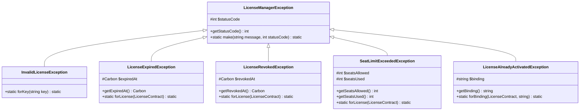

# Plan 07: Exception Hierarchy

## Objective

Design and implement the complete exception hierarchy for the package. Every failure scenario must have its own typed exception class, carry a useful message and contextual data, and map to a correct HTTP status code. This enables both granular catch blocks in application code and automatic JSON error responses via Laravel's global exception handler.

---

## 1. Exception Hierarchy



---

## 2. HTTP Status Code Mapping

| Exception | HTTP Status | Reason |
|-----------|------------|--------|
| `LicenseManagerException` (base) | 500 | Unknown/generic license error |
| `InvalidLicenseException` | 404 | The key does not exist — nothing to show |
| `LicenseExpiredException` | 403 | The key exists but access is denied |
| `LicenseRevokedException` | 403 | The key exists but access is denied |
| `SeatLimitExceededException` | 422 | Unprocessable — client must release a seat first |
| `LicenseAlreadyActivatedException` | 409 | Conflict — duplicate resource |

---

## 3. Exception Files

### File: `src/Exceptions/LicenseManagerException.php`

The base exception. All package exceptions extend this class, enabling a catch-all handler.

```php
<?php

namespace DevRavik\LaravelLicensing\Exceptions;

use RuntimeException;

/**
 * Base exception for all devravik/laravel-licensing errors.
 *
 * Catching this class will catch any exception thrown by the package.
 * Use the concrete subclasses for granular error handling.
 */
class LicenseManagerException extends RuntimeException
{
    /**
     * The HTTP status code that best represents this error.
     */
    protected int $statusCode = 500;

    /**
     * Return the HTTP status code for this exception.
     */
    public function getStatusCode(): int
    {
        return $this->statusCode;
    }

    /**
     * Create a new instance with a custom message and status code.
     *
     * Useful for creating ad-hoc exceptions in tests or extension code.
     */
    public static function make(string $message, int $statusCode = 500): static
    {
        $instance             = new static($message);
        $instance->statusCode = $statusCode;

        return $instance;
    }
}
```

---

### File: `src/Exceptions/InvalidLicenseException.php`

Thrown when a raw key does not match any record in the database.

```php
<?php

namespace DevRavik\LaravelLicensing\Exceptions;

/**
 * Thrown when a license key cannot be found in the database.
 *
 * The message intentionally does not reveal whether the key was
 * "wrong" vs. "not found" to prevent oracle attacks.
 */
class InvalidLicenseException extends LicenseManagerException
{
    protected int $statusCode = 404;

    /**
     * Create an exception for a given raw key attempt.
     *
     * The key is intentionally redacted from the message to prevent
     * accidental logging of sensitive data in error tracking services.
     */
    public static function forKey(string $key): static
    {
        return new static('The provided license key is invalid.');
    }
}
```

---

### File: `src/Exceptions/LicenseExpiredException.php`

Thrown when a license exists and is found but its expiration date has passed beyond the grace period.

```php
<?php

namespace DevRavik\LaravelLicensing\Exceptions;

use Carbon\Carbon;
use DevRavik\LaravelLicensing\Contracts\LicenseContract;

/**
 * Thrown when a license has expired beyond its configured grace period.
 *
 * This exception carries the expiration timestamp for use in error responses
 * or user-facing messages.
 */
class LicenseExpiredException extends LicenseManagerException
{
    protected int $statusCode = 403;

    /**
     * The timestamp when the license expired.
     */
    protected Carbon $expiredAt;

    /**
     * Return the expiration timestamp for this license.
     */
    public function getExpiredAt(): Carbon
    {
        return $this->expiredAt;
    }

    /**
     * Create an exception from a resolved license model.
     */
    public static function forLicense(LicenseContract $license): static
    {
        /** @var \DevRavik\LaravelLicensing\Models\License $license */
        $expiredAt = $license->expires_at;

        $instance            = new static(
            "This license expired on {$expiredAt->toFormattedDateString()} and is no longer valid."
        );
        $instance->expiredAt = $expiredAt;

        return $instance;
    }
}
```

---

### File: `src/Exceptions/LicenseRevokedException.php`

Thrown when the license's `revoked_at` timestamp is set.

```php
<?php

namespace DevRavik\LaravelLicensing\Exceptions;

use Carbon\Carbon;
use DevRavik\LaravelLicensing\Contracts\LicenseContract;

/**
 * Thrown when a license has been explicitly revoked.
 *
 * A revoked license cannot be re-activated without administrative intervention.
 */
class LicenseRevokedException extends LicenseManagerException
{
    protected int $statusCode = 403;

    /**
     * The timestamp when the license was revoked.
     */
    protected Carbon $revokedAt;

    /**
     * Return the revocation timestamp.
     */
    public function getRevokedAt(): Carbon
    {
        return $this->revokedAt;
    }

    /**
     * Create an exception from a resolved license model.
     */
    public static function forLicense(LicenseContract $license): static
    {
        /** @var \DevRavik\LaravelLicensing\Models\License $license */
        $revokedAt = $license->revoked_at;

        $instance            = new static(
            "This license was revoked on {$revokedAt->toFormattedDateString()} and can no longer be used."
        );
        $instance->revokedAt = $revokedAt;

        return $instance;
    }
}
```

---

### File: `src/Exceptions/SeatLimitExceededException.php`

Thrown when all activation seats on a license are occupied and a new activation is attempted.

```php
<?php

namespace DevRavik\LaravelLicensing\Exceptions;

use DevRavik\LaravelLicensing\Contracts\LicenseContract;

/**
 * Thrown when a license has no remaining activation seats.
 *
 * This exception carries the seat counts for use in detailed error responses.
 */
class SeatLimitExceededException extends LicenseManagerException
{
    protected int $statusCode = 422;

    /**
     * The maximum number of seats this license allows.
     */
    protected int $seatsAllowed;

    /**
     * The number of seats currently in use.
     */
    protected int $seatsUsed;

    /**
     * Return the maximum number of allowed seats.
     */
    public function getSeatsAllowed(): int
    {
        return $this->seatsAllowed;
    }

    /**
     * Return the number of seats currently in use.
     */
    public function getSeatsUsed(): int
    {
        return $this->seatsUsed;
    }

    /**
     * Create an exception from a resolved license model.
     */
    public static function forLicense(LicenseContract $license): static
    {
        /** @var \DevRavik\LaravelLicensing\Models\License $license */
        $allowed = $license->seats;
        $used    = $license->activations()->count();

        $instance               = new static(
            "This license allows {$allowed} activation(s) and all {$used} seats are currently in use. "
            . "Please deactivate an existing binding before adding a new one."
        );
        $instance->seatsAllowed = $allowed;
        $instance->seatsUsed    = $used;

        return $instance;
    }
}
```

---

### File: `src/Exceptions/LicenseAlreadyActivatedException.php`

Thrown when an activation is attempted with a binding that already exists on the license.

```php
<?php

namespace DevRavik\LaravelLicensing\Exceptions;

use DevRavik\LaravelLicensing\Contracts\LicenseContract;

/**
 * Thrown when attempting to activate a license against a binding that
 * is already registered for that license.
 *
 * This is a 409 Conflict because the resource (activation record) already
 * exists — it is not an authorization failure.
 */
class LicenseAlreadyActivatedException extends LicenseManagerException
{
    protected int $statusCode = 409;

    /**
     * The duplicate binding identifier.
     */
    protected string $binding;

    /**
     * Return the binding that caused the conflict.
     */
    public function getBinding(): string
    {
        return $this->binding;
    }

    /**
     * Create an exception for a specific license and binding.
     */
    public static function forBinding(LicenseContract $license, string $binding): static
    {
        $instance          = new static(
            "The binding '{$binding}' is already activated on this license."
        );
        $instance->binding = $binding;

        return $instance;
    }
}
```

---

## 4. Global Exception Handler Integration

Consumers can register a global handler in their Laravel application to automatically format all package exceptions into structured JSON:

```php
// bootstrap/app.php (Laravel 11+)
->withExceptions(function (Exceptions $exceptions) {
    $exceptions->render(function (
        \DevRavik\LaravelLicensing\Exceptions\LicenseManagerException $e,
        $request
    ) {
        if ($request->expectsJson()) {
            return response()->json([
                'error'   => class_basename($e),
                'message' => $e->getMessage(),
            ], $e->getStatusCode());
        }

        return redirect()->route('license.error')
            ->with('license_error', $e->getMessage());
    });
})
```

---

## 5. Static Factory Methods Pattern

All concrete exceptions expose a `static forXxx()` factory method. This pattern:

1. **Keeps message formatting in the exception** — not scattered in service classes.
2. **Allows type-safe access to contextual data** (`getExpiredAt()`, `getSeatsAllowed()`, etc.).
3. **Enables clean usage in `LicenseManager`** — `throw InvalidLicenseException::forKey($key)`.
4. **Mirrors the pattern in `spatie/laravel-permission`** for consistency.

---

## 6. Security: No Key Leakage in Messages

`InvalidLicenseException::forKey()` intentionally does NOT include the raw key in the exception message:

```php
// WRONG — leaks the key into logs, error tracking services:
return new static("The license key '{$key}' is invalid.");

// CORRECT — safe message, key never exposed:
return new static('The provided license key is invalid.');
```

This is consistent with how Laravel's Auth system avoids exposing credentials in exceptions.

---

## 7. Execution Checklist

- [ ] Create `src/Exceptions/LicenseManagerException.php` with `getStatusCode()` and `make()`
- [ ] Create `src/Exceptions/InvalidLicenseException.php` (HTTP 404) with `forKey()`
- [ ] Create `src/Exceptions/LicenseExpiredException.php` (HTTP 403) with `forLicense()` and `getExpiredAt()`
- [ ] Create `src/Exceptions/LicenseRevokedException.php` (HTTP 403) with `forLicense()` and `getRevokedAt()`
- [ ] Create `src/Exceptions/SeatLimitExceededException.php` (HTTP 422) with `forLicense()`, `getSeatsAllowed()`, `getSeatsUsed()`
- [ ] Create `src/Exceptions/LicenseAlreadyActivatedException.php` (HTTP 409) with `forBinding()` and `getBinding()`
- [ ] Verify all exceptions extend `LicenseManagerException`
- [ ] Verify no raw license keys appear in exception messages
- [ ] Add global exception handler example to README (Plan 10)
- [ ] Write exception unit tests (Plan 10)

---

## 8. Dependencies Between Plans

| Depends On | What Is Needed |
|-----------|----------------|
| Plan 01 | `src/Exceptions/` directory |
| Plan 03 | `LicenseContract` used in `forLicense()` factory methods |

| Enables | What This Plan Provides |
|---------|------------------------|
| Plan 05 | `LicenseManager` throws these exceptions in `validate()`, `activate()`, `revoke()` |
| Plan 09 | Middleware catches `LicenseManagerException` to return appropriate HTTP responses |
| Plan 10 | Test assertions use specific exception class names with `expectException()` |
