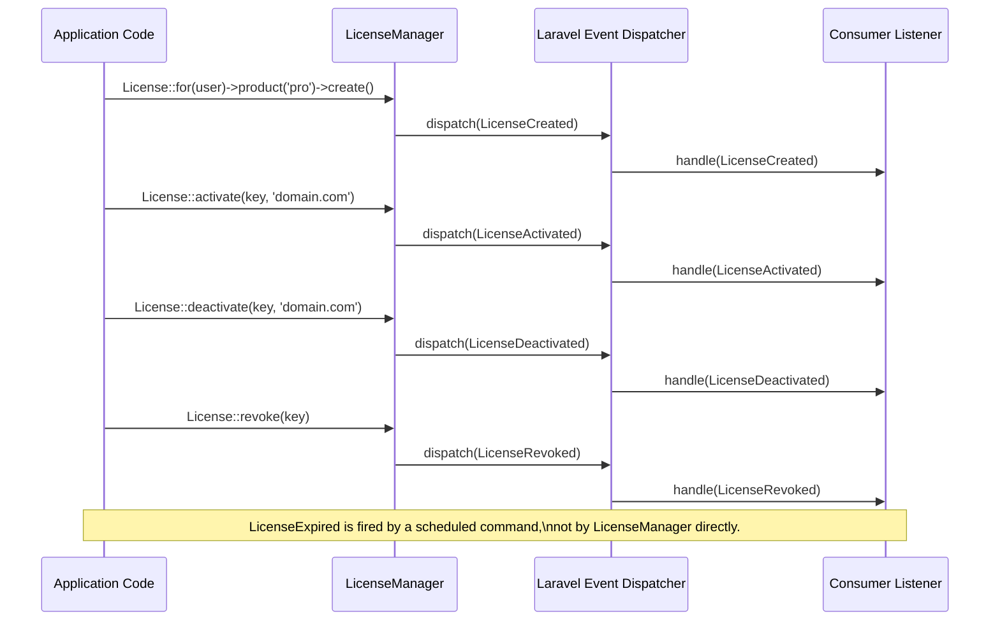

# Plan 08: Events System

## Objective

Implement all lifecycle event classes dispatched by `LicenseManager`. Events are the primary extension point for consumers — they hook into license operations (creation, activation, deactivation, revocation, expiration) to trigger notifications, logging, analytics, or any other business logic without modifying package code.

---

## 1. Event Lifecycle Map



---

## 2. Event Inventory

| Event Class | Dispatched By | Payload Properties | HTTP Trigger |
|-------------|--------------|-------------------|-------------|
| `LicenseCreated` | `createLicense()` | `$license` | POST (create license) |
| `LicenseActivated` | `activate()` | `$license`, `$activation` | POST (activate) |
| `LicenseDeactivated` | `deactivate()` | `$license`, `$binding` (string) | DELETE (deactivate) |
| `LicenseRevoked` | `revoke()` | `$license` | POST/DELETE (revoke) |
| `LicenseExpired` | Scheduled command | `$license` | Cron (not HTTP) |

---

## 3. Event Files

### File: `src/Events/LicenseCreated.php`

```php
<?php

namespace DevRavik\LaravelLicensing\Events;

use DevRavik\LaravelLicensing\Contracts\LicenseContract;
use Illuminate\Foundation\Events\Dispatchable;
use Illuminate\Queue\SerializesModels;

/**
 * Fired immediately after a new license is persisted to the database.
 *
 * Note: $event->license->key contains the RAW (unhashed) key at this point,
 * because LicenseManager sets the raw key on the model after saving.
 * Listeners that need to send the key to the user (e.g. email notification)
 * should use this event.
 *
 * After this event is handled, the raw key is no longer accessible.
 */
class LicenseCreated
{
    use Dispatchable, SerializesModels;

    /**
     * The newly created license instance.
     *
     * Note: The key attribute on this model is the RAW key (not hashed).
     * It will NOT match the database value on any subsequent retrieval.
     *
     * @var LicenseContract
     */
    public LicenseContract $license;

    /**
     * @param  LicenseContract  $license  The created license with raw key attached.
     */
    public function __construct(LicenseContract $license)
    {
        $this->license = $license;
    }
}
```

---

### File: `src/Events/LicenseActivated.php`

```php
<?php

namespace DevRavik\LaravelLicensing\Events;

use DevRavik\LaravelLicensing\Contracts\ActivationContract;
use DevRavik\LaravelLicensing\Contracts\LicenseContract;
use Illuminate\Foundation\Events\Dispatchable;
use Illuminate\Queue\SerializesModels;

/**
 * Fired after a license is successfully activated against a binding identifier.
 *
 * Useful for: logging activations, sending confirmation emails, updating
 * analytics dashboards, enforcing business rules on first activation.
 */
class LicenseActivated
{
    use Dispatchable, SerializesModels;

    /**
     * The license that was activated.
     *
     * @var LicenseContract
     */
    public LicenseContract $license;

    /**
     * The newly created activation record.
     *
     * @var ActivationContract
     */
    public ActivationContract $activation;

    /**
     * @param  LicenseContract    $license     The license being activated.
     * @param  ActivationContract $activation  The created activation record.
     */
    public function __construct(LicenseContract $license, ActivationContract $activation)
    {
        $this->license    = $license;
        $this->activation = $activation;
    }
}
```

---

### File: `src/Events/LicenseDeactivated.php`

```php
<?php

namespace DevRavik\LaravelLicensing\Events;

use DevRavik\LaravelLicensing\Contracts\LicenseContract;
use Illuminate\Foundation\Events\Dispatchable;
use Illuminate\Queue\SerializesModels;

/**
 * Fired after an activation binding is removed from a license.
 *
 * The freed seat is immediately available for a new activation.
 *
 * Note: Unlike LicenseActivated, this event carries the binding string
 * directly (not an Activation model) because the activation record has
 * already been deleted from the database at this point.
 */
class LicenseDeactivated
{
    use Dispatchable, SerializesModels;

    /**
     * The license from which the binding was removed.
     *
     * @var LicenseContract
     */
    public LicenseContract $license;

    /**
     * The binding identifier that was deactivated.
     *
     * @var string
     */
    public string $binding;

    /**
     * @param  LicenseContract  $license  The license that was deactivated.
     * @param  string           $binding  The binding string that was removed.
     */
    public function __construct(LicenseContract $license, string $binding)
    {
        $this->license = $license;
        $this->binding = $binding;
    }
}
```

---

### File: `src/Events/LicenseRevoked.php`

```php
<?php

namespace DevRavik\LaravelLicensing\Events;

use DevRavik\LaravelLicensing\Contracts\LicenseContract;
use Illuminate\Foundation\Events\Dispatchable;
use Illuminate\Queue\SerializesModels;

/**
 * Fired immediately after a license's revoked_at timestamp is set.
 *
 * After this event, all subsequent validate() and activate() calls on
 * this license's key will throw LicenseRevokedException.
 *
 * Useful for: notifying the affected user, logging the revocation actor,
 * canceling related subscriptions or access grants.
 */
class LicenseRevoked
{
    use Dispatchable, SerializesModels;

    /**
     * The revoked license instance.
     *
     * @var LicenseContract
     */
    public LicenseContract $license;

    /**
     * @param  LicenseContract  $license  The license that was revoked.
     */
    public function __construct(LicenseContract $license)
    {
        $this->license = $license;
    }
}
```

---

### File: `src/Events/LicenseExpired.php`

```php
<?php

namespace DevRavik\LaravelLicensing\Events;

use DevRavik\LaravelLicensing\Contracts\LicenseContract;
use Illuminate\Foundation\Events\Dispatchable;
use Illuminate\Queue\SerializesModels;

/**
 * Fired when a scheduled command detects that a license has fully expired.
 *
 * This event is NOT dispatched by LicenseManager during a validation call.
 * It is designed to be dispatched from a scheduled Artisan command or job
 * that sweeps the licenses table for expired records.
 *
 * Useful for: sending renewal reminder emails, disabling account features,
 * archiving records.
 *
 * Example scheduler setup:
 *
 *   Schedule::call(function () {
 *       License::query()
 *           ->whereNull('revoked_at')
 *           ->whereNotNull('expires_at')
 *           ->where('expires_at', '<=', now()->subDays(config('license.grace_period_days')))
 *           ->each(fn ($license) => event(new LicenseExpired($license)));
 *   })->daily();
 */
class LicenseExpired
{
    use Dispatchable, SerializesModels;

    /**
     * The expired license instance.
     *
     * @var LicenseContract
     */
    public LicenseContract $license;

    /**
     * @param  LicenseContract  $license  The license that has expired.
     */
    public function __construct(LicenseContract $license)
    {
        $this->license = $license;
    }
}
```

---

## 4. `SerializesModels` — Why It Matters

All events use `Illuminate\Queue\SerializesModels`. This trait ensures that when an event is queued (i.e., when listeners are queued), the Eloquent model is serialized by its primary key and re-hydrated from the database when the queued listener runs.

Without it, serializing a model with a large number of relationships could produce enormous queue payloads, or produce stale data if the model changes between dispatch and processing.

---

## 5. Consumer Registration Patterns

### Pattern A: EventServiceProvider (Laravel 10)

```php
// app/Providers/EventServiceProvider.php
protected $listen = [
    \DevRavik\LaravelLicensing\Events\LicenseCreated::class => [
        \App\Listeners\SendLicenseKeyEmail::class,
    ],
    \DevRavik\LaravelLicensing\Events\LicenseActivated::class => [
        \App\Listeners\LogActivationToAuditTrail::class,
    ],
    \DevRavik\LaravelLicensing\Events\LicenseRevoked::class => [
        \App\Listeners\NotifyUserOfRevocation::class,
        \App\Listeners\CancelDownstreamSubscription::class,
    ],
    \DevRavik\LaravelLicensing\Events\LicenseExpired::class => [
        \App\Listeners\SendRenewalReminderEmail::class,
    ],
];
```

### Pattern B: Closure listeners (Laravel 11+)

```php
// bootstrap/app.php or AppServiceProvider
use Illuminate\Support\Facades\Event;
use DevRavik\LaravelLicensing\Events\LicenseCreated;

Event::listen(LicenseCreated::class, function (LicenseCreated $event) {
    // $event->license->key is the raw key — send to the user now.
    Mail::to($event->license->owner->email)
        ->send(new LicenseIssuedMail($event->license->key));
});
```

### Pattern C: Queued Listener (best for email/notifications)

```php
namespace App\Listeners;

use DevRavik\LaravelLicensing\Events\LicenseCreated;
use Illuminate\Contracts\Queue\ShouldQueue;

class SendLicenseKeyEmail implements ShouldQueue
{
    public string $queue = 'notifications';

    public function handle(LicenseCreated $event): void
    {
        // SerializesModels re-hydrates $event->license from the DB.
        // IMPORTANT: $event->license->key is now the HASHED value here,
        // because the raw key was only set in-memory and not serialized.
        // You must capture the raw key and store it in the event or a
        // separate field before queuing if you need to use it.
        Mail::to($event->license->owner->email)
            ->send(new LicenseRenewalReminder($event->license));
    }
}
```

> **Critical Note on Queued Listeners and Raw Keys:** Because `SerializesModels` re-hydrates the model from the database, the raw (plaintext) key set on the model after `createLicense()` is NOT available in queued listeners. Consumers who need the raw key in a queued listener must either: (a) use a synchronous listener, or (b) pass the raw key as an additional event property.

---

## 6. Raw Key in `LicenseCreated` — Special Case

The `LicenseCreated` event is dispatched synchronously (it is not queued by the package). This means synchronous listeners receive the model with the raw key. The README must document this clearly:

```php
// SYNCHRONOUS listener — raw key IS available:
Event::listen(LicenseCreated::class, function ($event) {
    $rawKey = $event->license->key; // plaintext — send to user NOW
});

// QUEUED listener — raw key is NOT available (model re-hydrated from DB):
class SendKeyEmail implements ShouldQueue
{
    public function handle(LicenseCreated $event): void
    {
        $event->license->key; // This is now the HASH, not the raw key!
    }
}
```

---

## 7. Execution Checklist

- [ ] Create `src/Events/LicenseCreated.php` with `$license` property and raw key documentation
- [ ] Create `src/Events/LicenseActivated.php` with `$license` and `$activation` properties
- [ ] Create `src/Events/LicenseDeactivated.php` with `$license` and `$binding` (string) properties
- [ ] Create `src/Events/LicenseRevoked.php` with `$license` property
- [ ] Create `src/Events/LicenseExpired.php` with `$license` property and scheduler example in docblock
- [ ] Verify all events use `Dispatchable` and `SerializesModels` traits
- [ ] Verify `LicenseManager` dispatches the correct event for each operation (Plan 05)
- [ ] Document the queued listener raw key limitation in README
- [ ] Write event dispatch tests using `Event::fake()` (Plan 10)

---

## 8. Dependencies Between Plans

| Depends On | What Is Needed |
|-----------|----------------|
| Plan 01 | `src/Events/` directory |
| Plan 02 | `License` and `Activation` models carried as event payloads |
| Plan 03 | `LicenseContract` and `ActivationContract` used as property types |

| Enables | What This Plan Provides |
|---------|------------------------|
| Plan 05 | `LicenseManager` imports and dispatches all five event classes |
| Plan 10 | Tests use `Event::fake([LicenseCreated::class, ...])` to assert event dispatch |
