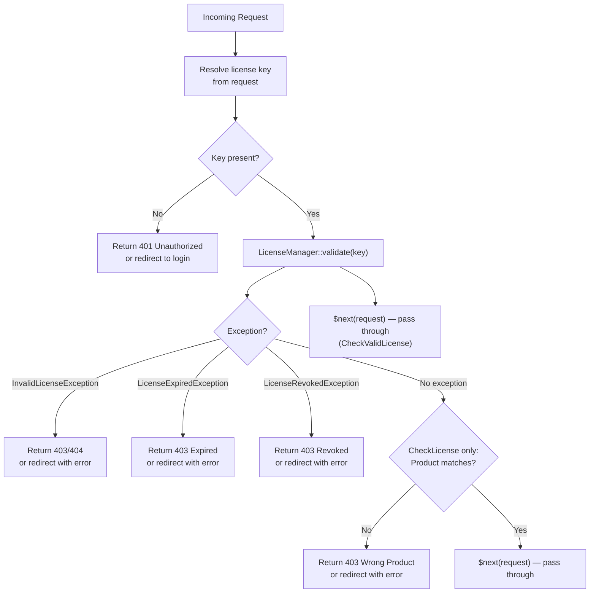

# Plan 09: Middleware

## Objective

Implement two HTTP middleware classes for route protection:

1. **`CheckLicense`** — guards routes that require a valid license for a specific product tier (e.g., `license:pro`).
2. **`CheckValidLicense`** — guards routes that require any valid license, regardless of product.

Both middleware classes must work correctly with web routes (returning HTTP redirects or views) and API routes (returning JSON responses), detect how to resolve the license key from the request, and handle all package exceptions gracefully.

---

## 1. Middleware Decision Flow



---

## 2. License Key Resolution from Requests

Middleware must accept the license key from multiple request sources, in priority order:

| Priority | Source | Header / Parameter | Example |
|----------|--------|-------------------|---------|
| 1 | Request header | `X-License-Key` | API use |
| 2 | Query parameter | `?license_key=...` | Simple GET validation |
| 3 | JSON body field | `{ "license_key": "..." }` | POST API |
| 4 | Form field | `license_key` (form POST) | Web forms |

---

## 3. `CheckLicense` Middleware

Protects routes that require a valid license for a **specific product tier**. The product name is passed as a middleware parameter: `license:pro`, `license:enterprise`.

### File: `src/Http/Middleware/CheckLicense.php`

```php
<?php

namespace DevRavik\LaravelLicensing\Http\Middleware;

use Closure;
use DevRavik\LaravelLicensing\Contracts\LicenseManagerContract;
use DevRavik\LaravelLicensing\Exceptions\LicenseManagerException;
use Illuminate\Http\Request;
use Symfony\Component\HttpFoundation\Response;

/**
 * Middleware that checks for a valid license for a specific product tier.
 *
 * Usage in routes:
 *   Route::middleware('license:pro')->group(function () { ... });
 *   Route::middleware('license:enterprise')->group(function () { ... });
 *
 * The middleware resolves the license key from (in order):
 *   1. X-License-Key header
 *   2. license_key query parameter
 *   3. license_key body field (JSON or form)
 */
class CheckLicense
{
    public function __construct(
        protected LicenseManagerContract $licenseManager
    ) {}

    /**
     * Handle an incoming request.
     *
     * @param  string  $product  The required product tier (passed by Laravel's middleware pipeline).
     */
    public function handle(Request $request, Closure $next, string $product): Response
    {
        $key = $this->resolveLicenseKey($request);

        if ($key === null) {
            return $this->denyResponse($request, 'A valid license key is required.', 401);
        }

        try {
            $license = $this->licenseManager->validate($key);
        } catch (LicenseManagerException $e) {
            return $this->denyResponse($request, $e->getMessage(), $e->getStatusCode());
        }

        // Verify the license is for the required product.
        if ($license->product !== $product) {
            return $this->denyResponse(
                $request,
                "This route requires a '{$product}' license. "
                . "The provided license is for '{$license->product}'.",
                403
            );
        }

        // Attach the resolved license to the request for downstream use.
        $request->attributes->set('license', $license);

        return $next($request);
    }

    /**
     * Resolve the license key from the request using the priority order.
     */
    protected function resolveLicenseKey(Request $request): ?string
    {
        // 1. X-License-Key header (most common for API clients)
        if ($request->hasHeader('X-License-Key')) {
            return $request->header('X-License-Key');
        }

        // 2. Query parameter or body field (covers GET, POST form, POST JSON)
        return $request->input('license_key') ?: null;
    }

    /**
     * Return the appropriate denial response based on the request type.
     *
     * API requests (Accept: application/json) receive a JSON response.
     * Web requests receive an HTTP abort response.
     */
    protected function denyResponse(Request $request, string $message, int $status): Response
    {
        if ($request->expectsJson()) {
            return response()->json([
                'error'   => 'license_check_failed',
                'message' => $message,
            ], $status);
        }

        abort($status, $message);
    }
}
```

---

## 4. `CheckValidLicense` Middleware

Protects routes that require **any** valid license, without checking the product tier. Use this for general licensed areas where the product matters at the application level, not at the route level.

### File: `src/Http/Middleware/CheckValidLicense.php`

```php
<?php

namespace DevRavik\LaravelLicensing\Http\Middleware;

use Closure;
use DevRavik\LaravelLicensing\Contracts\LicenseManagerContract;
use DevRavik\LaravelLicensing\Exceptions\LicenseManagerException;
use Illuminate\Http\Request;
use Symfony\Component\HttpFoundation\Response;

/**
 * Middleware that checks for any valid license, regardless of product.
 *
 * Usage in routes:
 *   Route::middleware('license.valid')->group(function () { ... });
 *
 * This is the simpler counterpart to CheckLicense. Use it when you
 * only need to verify that the caller has a valid license of any kind.
 */
class CheckValidLicense
{
    public function __construct(
        protected LicenseManagerContract $licenseManager
    ) {}

    /**
     * Handle an incoming request.
     */
    public function handle(Request $request, Closure $next): Response
    {
        $key = $this->resolveLicenseKey($request);

        if ($key === null) {
            return $this->denyResponse($request, 'A valid license key is required.', 401);
        }

        try {
            $license = $this->licenseManager->validate($key);
        } catch (LicenseManagerException $e) {
            return $this->denyResponse($request, $e->getMessage(), $e->getStatusCode());
        }

        // Attach the resolved license to the request for downstream use.
        $request->attributes->set('license', $license);

        return $next($request);
    }

    /**
     * Resolve the license key from the request.
     */
    protected function resolveLicenseKey(Request $request): ?string
    {
        if ($request->hasHeader('X-License-Key')) {
            return $request->header('X-License-Key');
        }

        return $request->input('license_key') ?: null;
    }

    /**
     * Return the appropriate denial response.
     */
    protected function denyResponse(Request $request, string $message, int $status): Response
    {
        if ($request->expectsJson()) {
            return response()->json([
                'error'   => 'license_check_failed',
                'message' => $message,
            ], $status);
        }

        abort($status, $message);
    }
}
```

---

## 5. Accessing the Resolved License in Controllers

When middleware passes, it attaches the validated `License` model to `$request->attributes` under the key `'license'`. Controllers can access it without re-validating:

```php
use DevRavik\LaravelLicensing\Models\License;

class ProDashboardController extends Controller
{
    public function index(Request $request)
    {
        /** @var License $license */
        $license = $request->attributes->get('license');

        return view('dashboard.pro', [
            'product'       => $license->product,
            'expiresAt'     => $license->expires_at,
            'seatsRemaining' => $license->seatsRemaining(),
            'inGracePeriod' => $license->isInGracePeriod(),
        ]);
    }
}
```

---

## 6. Registration (Service Provider)

The service provider (Plan 06) registers the middleware aliases in `boot()`:

```php
// In LicenseServiceProvider::registerMiddleware()
$router->aliasMiddleware('license',       CheckLicense::class);
$router->aliasMiddleware('license.valid', CheckValidLicense::class);
```

### Consumer Route Usage

```php
// routes/api.php

// Product-specific license check
Route::middleware(['auth:sanctum', 'license:pro'])->group(function () {
    Route::get('/pro/features', [ProController::class, 'index']);
});

// Any valid license
Route::middleware(['auth:sanctum', 'license.valid'])->group(function () {
    Route::get('/licensed-area', [LicensedController::class, 'index']);
});
```

### Laravel 11+ Registration Without Service Provider Method

Consumers using Laravel 11 can also register directly in `bootstrap/app.php`:

```php
->withMiddleware(function (Middleware $middleware) {
    $middleware->alias([
        'license'       => \DevRavik\LaravelLicensing\Http\Middleware\CheckLicense::class,
        'license.valid' => \DevRavik\LaravelLicensing\Http\Middleware\CheckValidLicense::class,
    ]);
})
```

> The service provider registers these automatically. The manual registration above is only needed if consumers disable the service provider's middleware registration.

---

## 7. Extending the Middleware

Consumers can extend either middleware to customize behavior (e.g., resolve the key from a different location, return a custom view for web requests):

```php
namespace App\Http\Middleware;

use DevRavik\LaravelLicensing\Http\Middleware\CheckLicense as BaseCheckLicense;
use Illuminate\Http\Request;

class CheckLicense extends BaseCheckLicense
{
    /**
     * Override key resolution to also check a cookie.
     */
    protected function resolveLicenseKey(Request $request): ?string
    {
        // Check cookie first (for single-page apps that store the key client-side).
        if ($request->hasCookie('license_key')) {
            return $request->cookie('license_key');
        }

        return parent::resolveLicenseKey($request);
    }

    /**
     * Override denial response to redirect to a custom license purchase page.
     */
    protected function denyResponse(Request $request, string $message, int $status): mixed
    {
        if (! $request->expectsJson()) {
            return redirect()->route('license.purchase')->with('error', $message);
        }

        return parent::denyResponse($request, $message, $status);
    }
}
```

---

## 8. Grace Period Handling in Middleware

The middleware calls `validate()` which already handles grace periods correctly: a license in its grace period passes validation but `$license->isInGracePeriod()` is `true`. Controllers can check this to display a renewal warning.

```php
// In a controller after the middleware passes:
$license = $request->attributes->get('license');

if ($license->isInGracePeriod()) {
    session()->flash(
        'warning',
        'Your license has expired. You have ' . $license->graceDaysRemaining() . ' day(s) to renew.'
    );
}
```

For stricter grace period handling at the middleware level, `CheckLicense` can be extended:

```php
protected function handle(...): Response
{
    $response = parent::handle($request, $next, $product);

    // If we passed but are in grace period, add a warning header.
    $license = $request->attributes->get('license');
    if ($license?->isInGracePeriod()) {
        $response->headers->set('X-License-Grace-Days', $license->graceDaysRemaining());
    }

    return $response;
}
```

---

## 9. Execution Checklist

- [ ] Create `src/Http/Middleware/` directory
- [ ] Create `src/Http/Middleware/CheckLicense.php` with `handle(Request, Closure, string $product)`
- [ ] Create `src/Http/Middleware/CheckValidLicense.php` with `handle(Request, Closure)`
- [ ] Implement `resolveLicenseKey()` in both (X-License-Key header → `license_key` input)
- [ ] Implement `denyResponse()` in both (JSON for API, `abort()` for web)
- [ ] Attach validated `$license` to `$request->attributes->set('license', ...)` after passing
- [ ] Inject `LicenseManagerContract` via constructor (not the facade, for testability)
- [ ] Verify `LicenseServiceProvider::registerMiddleware()` registers aliases `license` and `license.valid`
- [ ] Write middleware feature tests: valid key passes, invalid key is denied, wrong product is denied (Plan 10)

---

## 10. Dependencies Between Plans

| Depends On | What Is Needed |
|-----------|----------------|
| Plan 03 | `LicenseManagerContract` injected into both middleware constructors |
| Plan 05 | `LicenseManager::validate()` called to resolve the license |
| Plan 06 | Service provider registers middleware aliases; middleware is injectable via container |
| Plan 07 | `LicenseManagerException` caught in the middleware to produce HTTP responses |

| Enables | What This Plan Provides |
|---------|------------------------|
| Plan 10 | Middleware tests in `tests/Feature/MiddlewareTest.php` |
