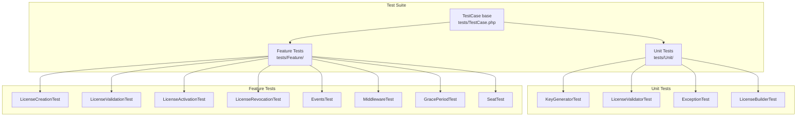

# Plan 10: Testing Suite & CI/CD Pipeline & Packagist Publishing

## Objective

Build a comprehensive test suite (unit + feature), configure GitHub Actions CI/CD pipelines (tests, static analysis), and complete all steps required to publish the package on Packagist as a production-quality open-source release. This plan transforms the codebase into a package that developers will trust, cite, and install.

---

## 1. Test Architecture Overview



---

## 2. `tests/TestCase.php` (Final Version)

```php
<?php

namespace DevRavik\LaravelLicensing\Tests;

use DevRavik\LaravelLicensing\LicenseServiceProvider;
use Illuminate\Database\Eloquent\Factories\Factory;
use Illuminate\Foundation\Testing\RefreshDatabase;
use Orchestra\Testbench\TestCase as Orchestra;

abstract class TestCase extends Orchestra
{
    use RefreshDatabase;

    protected function setUp(): void
    {
        parent::setUp();
        $this->loadMigrationsFrom(__DIR__ . '/../database/migrations');
    }

    protected function getPackageProviders($app): array
    {
        return [
            LicenseServiceProvider::class,
        ];
    }

    protected function getEnvironmentSetUp($app): void
    {
        config()->set('database.default', 'testing');
        config()->set('database.connections.testing', [
            'driver'   => 'sqlite',
            'database' => ':memory:',
            'prefix'   => '',
        ]);

        // Use low bcrypt cost for fast test runs.
        config()->set('hashing.bcrypt.rounds', 4);
    }

    /**
     * Create a fake User model for license ownership tests.
     * Uses orchestra/testbench's built-in User model.
     */
    protected function createUser(): \Illuminate\Foundation\Auth\User
    {
        return \Orchestra\Testbench\Factories\UserFactory::new()->create();
    }
}
```

---

## 3. Unit Tests

### File: `tests/Unit/KeyGeneratorTest.php`

```php
<?php

namespace DevRavik\LaravelLicensing\Tests\Unit;

use DevRavik\LaravelLicensing\KeyGenerator;
use DevRavik\LaravelLicensing\Tests\TestCase;

class KeyGeneratorTest extends TestCase
{
    private KeyGenerator $generator;

    protected function setUp(): void
    {
        parent::setUp();
        $this->generator = new KeyGenerator();
    }

    public function test_generates_key_of_exact_requested_length(): void
    {
        foreach ([16, 24, 32, 48, 64] as $length) {
            $key = $this->generator->generate($length);
            $this->assertSame($length, strlen($key), "Key length mismatch for requested length {$length}");
        }
    }

    public function test_generated_keys_are_hexadecimal(): void
    {
        $key = $this->generator->generate(32);
        $this->assertMatchesRegularExpression('/^[0-9a-f]+$/', $key);
    }

    public function test_generated_keys_are_unique(): void
    {
        $keys = array_map(fn () => $this->generator->generate(32), range(1, 100));
        $this->assertSame(count($keys), count(array_unique($keys)));
    }

    public function test_throws_for_key_length_below_minimum(): void
    {
        $this->expectException(\InvalidArgumentException::class);
        $this->generator->generate(8);
    }

    public function test_throws_for_key_length_above_maximum(): void
    {
        $this->expectException(\InvalidArgumentException::class);
        $this->generator->generate(256);
    }
}
```

---

### File: `tests/Unit/ExceptionTest.php`

```php
<?php

namespace DevRavik\LaravelLicensing\Tests\Unit;

use DevRavik\LaravelLicensing\Exceptions\InvalidLicenseException;
use DevRavik\LaravelLicensing\Exceptions\LicenseManagerException;
use DevRavik\LaravelLicensing\Exceptions\SeatLimitExceededException;
use DevRavik\LaravelLicensing\Tests\TestCase;

class ExceptionTest extends TestCase
{
    public function test_all_exceptions_extend_base_exception(): void
    {
        $exceptions = [
            \DevRavik\LaravelLicensing\Exceptions\InvalidLicenseException::class,
            \DevRavik\LaravelLicensing\Exceptions\LicenseExpiredException::class,
            \DevRavik\LaravelLicensing\Exceptions\LicenseRevokedException::class,
            \DevRavik\LaravelLicensing\Exceptions\SeatLimitExceededException::class,
            \DevRavik\LaravelLicensing\Exceptions\LicenseAlreadyActivatedException::class,
        ];

        foreach ($exceptions as $class) {
            $this->assertTrue(
                is_subclass_of($class, LicenseManagerException::class),
                "{$class} does not extend LicenseManagerException"
            );
        }
    }

    public function test_invalid_license_exception_has_correct_status_code(): void
    {
        $e = InvalidLicenseException::forKey('fake-key');
        $this->assertSame(404, $e->getStatusCode());
    }

    public function test_exception_message_does_not_contain_raw_key(): void
    {
        $rawKey = 'super-secret-key-12345';
        $e = InvalidLicenseException::forKey($rawKey);
        $this->assertStringNotContainsString($rawKey, $e->getMessage());
    }
}
```

---

## 4. Feature Tests

### File: `tests/Feature/LicenseCreationTest.php`

```php
<?php

namespace DevRavik\LaravelLicensing\Tests\Feature;

use DevRavik\LaravelLicensing\Facades\License;
use DevRavik\LaravelLicensing\Tests\TestCase;

class LicenseCreationTest extends TestCase
{
    public function test_license_can_be_created_for_a_user(): void
    {
        $user = $this->createUser();

        $license = License::for($user)
            ->product('pro')
            ->seats(3)
            ->expiresInDays(30)
            ->create();

        $this->assertNotNull($license->key);
        $this->assertSame('pro', $license->product);
        $this->assertSame(3, $license->seats);
        $this->assertDatabaseHas('licenses', [
            'product'    => 'pro',
            'owner_id'   => $user->id,
            'owner_type' => get_class($user),
        ]);
    }

    public function test_raw_key_is_returned_at_creation_time(): void
    {
        $user    = $this->createUser();
        $license = License::for($user)->product('pro')->create();
        $rawKey  = $license->key;

        $this->assertNotEmpty($rawKey);
        $this->assertSame(32, strlen($rawKey)); // default key_length
    }

    public function test_raw_key_is_not_stored_in_database(): void
    {
        $user    = $this->createUser();
        $license = License::for($user)->product('pro')->create();
        $rawKey  = $license->key;

        $this->assertDatabaseMissing('licenses', ['key' => $rawKey]);
    }

    public function test_license_without_expiry_uses_config_default(): void
    {
        config()->set('license.default_expiry_days', 90);

        $user    = $this->createUser();
        $license = License::for($user)->product('pro')->create();

        $this->assertNotNull($license->fresh()->expires_at);
        $this->assertEqualsWithDelta(
            now()->addDays(90)->timestamp,
            $license->fresh()->expires_at->timestamp,
            60 // within 60 seconds
        );
    }

    public function test_product_is_required_before_create(): void
    {
        $this->expectException(\InvalidArgumentException::class);

        $user = $this->createUser();
        License::for($user)->create();
    }
}
```

---

### File: `tests/Feature/LicenseValidationTest.php`

```php
<?php

namespace DevRavik\LaravelLicensing\Tests\Feature;

use Carbon\Carbon;
use DevRavik\LaravelLicensing\Exceptions\InvalidLicenseException;
use DevRavik\LaravelLicensing\Exceptions\LicenseExpiredException;
use DevRavik\LaravelLicensing\Exceptions\LicenseRevokedException;
use DevRavik\LaravelLicensing\Facades\License;
use DevRavik\LaravelLicensing\Tests\TestCase;

class LicenseValidationTest extends TestCase
{
    public function test_valid_license_passes_validation(): void
    {
        $user    = $this->createUser();
        $license = License::for($user)->product('pro')->create();
        $rawKey  = $license->key;

        $validated = License::validate($rawKey);

        $this->assertTrue($validated->isValid());
        $this->assertFalse($validated->isExpired());
        $this->assertFalse($validated->isRevoked());
    }

    public function test_invalid_key_throws_exception(): void
    {
        $this->expectException(InvalidLicenseException::class);
        License::validate('completely-invalid-key-that-does-not-exist');
    }

    public function test_expired_license_throws_exception(): void
    {
        $user    = $this->createUser();
        $license = License::for($user)->product('pro')->expiresAt(Carbon::yesterday())->create();
        $rawKey  = $license->key;

        // Update the hash in DB since expiresAt(yesterday) would throw.
        // We create it normally and manually update expires_at.
        $user2    = $this->createUser();
        $license2 = License::for($user2)->product('pro')->expiresInDays(1)->create();
        $rawKey2  = $license2->key;
        $license2->fresh()->update(['expires_at' => Carbon::yesterday()]);

        config()->set('license.grace_period_days', 0);

        $this->expectException(LicenseExpiredException::class);
        License::validate($rawKey2);
    }

    public function test_license_in_grace_period_passes_validation(): void
    {
        config()->set('license.grace_period_days', 7);

        $user    = $this->createUser();
        $license = License::for($user)->product('pro')->expiresInDays(1)->create();
        $rawKey  = $license->key;

        // Manually push expires_at 3 days into the past (within grace period).
        $license->fresh()->update(['expires_at' => now()->subDays(3)]);

        $validated = License::validate($rawKey);

        $this->assertTrue($validated->isInGracePeriod());
    }

    public function test_revoked_license_fails_validation(): void
    {
        $user    = $this->createUser();
        $license = License::for($user)->product('pro')->create();
        $rawKey  = $license->key;

        License::revoke($rawKey);

        $this->expectException(LicenseRevokedException::class);
        License::validate($rawKey);
    }
}
```

---

### File: `tests/Feature/LicenseActivationTest.php`

```php
<?php

namespace DevRavik\LaravelLicensing\Tests\Feature;

use DevRavik\LaravelLicensing\Exceptions\LicenseAlreadyActivatedException;
use DevRavik\LaravelLicensing\Exceptions\SeatLimitExceededException;
use DevRavik\LaravelLicensing\Facades\License;
use DevRavik\LaravelLicensing\Tests\TestCase;

class LicenseActivationTest extends TestCase
{
    public function test_license_can_be_activated(): void
    {
        $user    = $this->createUser();
        $license = License::for($user)->product('pro')->seats(2)->create();
        $key     = $license->key;

        $activation = License::activate($key, 'app.example.com');

        $this->assertNotNull($activation->getId());
        $this->assertDatabaseHas('license_activations', [
            'binding' => 'app.example.com',
        ]);
    }

    public function test_seat_limit_is_enforced(): void
    {
        $user    = $this->createUser();
        $license = License::for($user)->product('pro')->seats(2)->create();
        $key     = $license->key;

        License::activate($key, 'domain-1.com');
        License::activate($key, 'domain-2.com');

        $this->expectException(SeatLimitExceededException::class);
        License::activate($key, 'domain-3.com');
    }

    public function test_duplicate_binding_throws_exception(): void
    {
        $user    = $this->createUser();
        $license = License::for($user)->product('pro')->seats(5)->create();
        $key     = $license->key;

        License::activate($key, 'domain-1.com');

        $this->expectException(LicenseAlreadyActivatedException::class);
        License::activate($key, 'domain-1.com');
    }

    public function test_deactivation_frees_a_seat(): void
    {
        $user    = $this->createUser();
        $license = License::for($user)->product('pro')->seats(1)->create();
        $key     = $license->key;

        License::activate($key, 'domain-1.com');
        License::deactivate($key, 'domain-1.com');
        License::activate($key, 'domain-2.com');

        $this->assertDatabaseHas('license_activations', ['binding' => 'domain-2.com']);
        $this->assertDatabaseMissing('license_activations', ['binding' => 'domain-1.com']);
    }

    public function test_seats_remaining_is_calculated_correctly(): void
    {
        $user    = $this->createUser();
        $license = License::for($user)->product('pro')->seats(3)->create();
        $key     = $license->key;

        $this->assertSame(3, $license->fresh()->seatsRemaining());

        License::activate($key, 'domain-1.com');
        $this->assertSame(2, $license->fresh()->seatsRemaining());

        License::activate($key, 'domain-2.com');
        $this->assertSame(1, $license->fresh()->seatsRemaining());
    }
}
```

---

### File: `tests/Feature/EventsTest.php`

```php
<?php

namespace DevRavik\LaravelLicensing\Tests\Feature;

use DevRavik\LaravelLicensing\Events\LicenseActivated;
use DevRavik\LaravelLicensing\Events\LicenseCreated;
use DevRavik\LaravelLicensing\Events\LicenseDeactivated;
use DevRavik\LaravelLicensing\Events\LicenseRevoked;
use DevRavik\LaravelLicensing\Facades\License;
use DevRavik\LaravelLicensing\Tests\TestCase;
use Illuminate\Support\Facades\Event;

class EventsTest extends TestCase
{
    public function test_license_created_event_is_dispatched(): void
    {
        Event::fake([LicenseCreated::class]);

        $user = $this->createUser();
        $license = License::for($user)->product('pro')->create();

        Event::assertDispatched(LicenseCreated::class, function ($event) use ($license) {
            return $event->license->product === 'pro';
        });
    }

    public function test_license_activated_event_is_dispatched(): void
    {
        Event::fake([LicenseCreated::class, LicenseActivated::class]);

        $user    = $this->createUser();
        $license = License::for($user)->product('pro')->create();
        $key     = $license->key;

        License::activate($key, 'example.com');

        Event::assertDispatched(LicenseActivated::class, function ($event) {
            return $event->activation->getBinding() === 'example.com';
        });
    }

    public function test_license_deactivated_event_is_dispatched(): void
    {
        Event::fake([LicenseCreated::class, LicenseDeactivated::class]);

        $user    = $this->createUser();
        $license = License::for($user)->product('pro')->create();
        $key     = $license->key;

        License::activate($key, 'example.com');
        License::deactivate($key, 'example.com');

        Event::assertDispatched(LicenseDeactivated::class, function ($event) {
            return $event->binding === 'example.com';
        });
    }

    public function test_license_revoked_event_is_dispatched(): void
    {
        Event::fake([LicenseCreated::class, LicenseRevoked::class]);

        $user    = $this->createUser();
        $license = License::for($user)->product('pro')->create();
        $key     = $license->key;

        License::revoke($key);

        Event::assertDispatched(LicenseRevoked::class);
    }
}
```

---

### File: `tests/Feature/MiddlewareTest.php`

```php
<?php

namespace DevRavik\LaravelLicensing\Tests\Feature;

use DevRavik\LaravelLicensing\Facades\License;
use DevRavik\LaravelLicensing\Tests\TestCase;
use Illuminate\Support\Facades\Route;

class MiddlewareTest extends TestCase
{
    protected function setUp(): void
    {
        parent::setUp();

        // Register test routes using the middleware aliases.
        Route::get('/test/pro', fn () => 'ok')->middleware('license:pro');
        Route::get('/test/any', fn () => 'ok')->middleware('license.valid');
    }

    public function test_valid_pro_license_passes_check_license_middleware(): void
    {
        $user    = $this->createUser();
        $license = License::for($user)->product('pro')->create();

        $this->getJson('/test/pro', ['X-License-Key' => $license->key])
             ->assertOk()
             ->assertSee('ok');
    }

    public function test_wrong_product_is_denied_by_check_license_middleware(): void
    {
        $user    = $this->createUser();
        $license = License::for($user)->product('basic')->create();

        $this->getJson('/test/pro', ['X-License-Key' => $license->key])
             ->assertForbidden();
    }

    public function test_missing_key_returns_401(): void
    {
        $this->getJson('/test/pro')
             ->assertUnauthorized();
    }

    public function test_invalid_key_returns_403_or_404(): void
    {
        $this->getJson('/test/pro', ['X-License-Key' => 'totally-fake-key'])
             ->assertStatus(404);
    }

    public function test_valid_any_license_passes_check_valid_license_middleware(): void
    {
        $user    = $this->createUser();
        $license = License::for($user)->product('basic')->create();

        $this->getJson('/test/any', ['X-License-Key' => $license->key])
             ->assertOk();
    }
}
```

---

## 5. GitHub Actions — CI Pipeline

### File: `.github/workflows/tests.yml`

```yaml
name: Tests

on:
  push:
    branches: [main, develop]
  pull_request:
    branches: [main]

jobs:
  test:
    runs-on: ubuntu-latest

    strategy:
      fail-fast: false
      matrix:
        php: ['8.1', '8.2', '8.3']
        laravel: ['10.*', '11.*', '12.*']
        stability: [prefer-stable]
        include:
          - laravel: '10.*'
            testbench: '8.*'
          - laravel: '11.*'
            testbench: '9.*'
          - laravel: '12.*'
            testbench: '10.*'

    name: PHP ${{ matrix.php }} — Laravel ${{ matrix.laravel }}

    steps:
      - name: Checkout code
        uses: actions/checkout@v4

      - name: Setup PHP
        uses: shivammathur/setup-php@v2
        with:
          php-version: ${{ matrix.php }}
          extensions: dom, curl, libxml, mbstring, zip, pcntl, pdo, sqlite, pdo_sqlite
          coverage: xdebug

      - name: Install dependencies
        run: |
          composer require "laravel/framework:${{ matrix.laravel }}" \
                           "orchestra/testbench:${{ matrix.testbench }}" \
                           --no-interaction --no-update
          composer update --${{ matrix.stability }} --prefer-dist --no-interaction

      - name: Run tests
        run: vendor/bin/phpunit --coverage-clover coverage.xml

      - name: Upload coverage to Codecov
        uses: codecov/codecov-action@v4
        with:
          file: ./coverage.xml
```

---

### File: `.github/workflows/static-analysis.yml`

```yaml
name: Static Analysis

on:
  push:
    branches: [main]
  pull_request:
    branches: [main]

jobs:
  phpstan:
    runs-on: ubuntu-latest
    name: PHPStan

    steps:
      - uses: actions/checkout@v4

      - name: Setup PHP
        uses: shivammathur/setup-php@v2
        with:
          php-version: '8.3'
          coverage: none

      - name: Install dependencies
        run: composer update --prefer-stable --prefer-dist --no-interaction

      - name: Run PHPStan
        run: vendor/bin/phpstan analyse --no-progress --error-format=github
```

---

## 6. Packagist Publishing Steps

### Prerequisites

1. Push the repository to GitHub at `https://github.com/devravik/laravel-licensing`
2. Create a `v1.0.0` tag: `git tag v1.0.0 && git push origin v1.0.0`

### Registration on Packagist

1. Log in to [packagist.org](https://packagist.org) with the `devravik` account.
2. Click "Submit" and enter: `https://github.com/devravik/laravel-licensing`
3. Click "Check". Packagist will validate `composer.json` and show the package name.
4. Click "Submit" to publish.

### GitHub Webhook Setup (Auto-update on push)

1. In Packagist, go to the package page → "Settings" → copy the API token.
2. In GitHub: Settings → Webhooks → Add webhook.
   - Payload URL: `https://packagist.org/api/github?username=devravik`
   - Content type: `application/json`
   - Secret: your Packagist API token
   - Events: "Just the push event"
3. Packagist will now automatically index new tags within minutes of pushing.

### Packagist README Badges

Add these badges to the top of `README.md` for credibility:

```markdown
[](https://packagist.org/packages/devravik/laravel-licensing)
[](https://packagist.org/packages/devravik/laravel-licensing)
[](https://github.com/devravik/laravel-licensing/actions/workflows/tests.yml)
[](https://packagist.org/packages/devravik/laravel-licensing)
```

---

## 7. Release Checklist (v1.0.0)

### Code Quality
- [ ] All PHPStan level 6 errors resolved
- [ ] All test files created and passing locally
- [ ] CI matrix passes for PHP 8.1, 8.2, 8.3 × Laravel 10, 11, 12
- [ ] `composer pint` run to enforce code style

### Package Completeness
- [ ] `composer.json` has `name`, `description`, `keywords`, `license`, `authors`
- [ ] `extra.laravel` block present with provider and alias
- [ ] `config/license.php` complete with all 6 options
- [ ] Both migration files present with all indexes
- [ ] All 12 source files in `src/` present and autoloadable
- [ ] `LICENSE` file present with MIT text
- [ ] `CHANGELOG.md` has `[1.0.0]` section with initial feature list
- [ ] `SECURITY.md` present with contact email
- [ ] `README.md` complete (already written)

### Repository
- [ ] GitHub repository created at `https://github.com/devravik/laravel-licensing`
- [ ] Repository is public
- [ ] GitHub Actions CI passing on `main` branch
- [ ] `v1.0.0` tag created and pushed
- [ ] Packagist webhook configured for auto-update

### Post-publish
- [ ] Verify `composer require devravik/laravel-licensing` works in a fresh Laravel app
- [ ] Confirm badges on README display correct version and build status
- [ ] Post announcement on LinkedIn and/or Laravel News

---

## 8. Test Coverage Targets

| Area | Target Coverage | Rationale |
|------|----------------|-----------|
| `KeyGenerator` | 100% | Pure function, trivially testable |
| `LicenseBuilder` | 100% | All validation paths and terminal method |
| `LicenseManager` | ≥ 95% | All lifecycle methods and exception paths |
| `LicenseValidator` | 100% | Simple state checks |
| `Exceptions` | ≥ 90% | Factory methods and status code getters |
| Middleware | ≥ 90% | API and web paths, valid/invalid/wrong-product |
| Events | 100% | All events dispatched |
| Models | ≥ 85% | Status methods and relationships |

---

## 9. Dependencies Between Plans

| Depends On | What Is Needed |
|-----------|----------------|
| Plan 01 | `tests/` directory structure, `TestCase.php`, `phpunit.xml` |
| Plan 02 | Migrations loaded by `TestCase::setUp()`, models used in tests |
| Plan 03 | Contract type-hints in test assertions |
| Plan 04 | `KeyGenerator` tested directly; `LicenseBuilder` used via facade |
| Plan 05 | `LicenseManager` is the system under test for all feature tests |
| Plan 06 | `LicenseServiceProvider` loaded in `getPackageProviders()` |
| Plan 07 | Exceptions referenced in `expectException()` calls |
| Plan 08 | Events faked with `Event::fake()` in `EventsTest` |
| Plan 09 | Middleware tested with `$this->getJson()` and header assertions |

This plan has no downstream dependencies — it is the final step before publishing.
