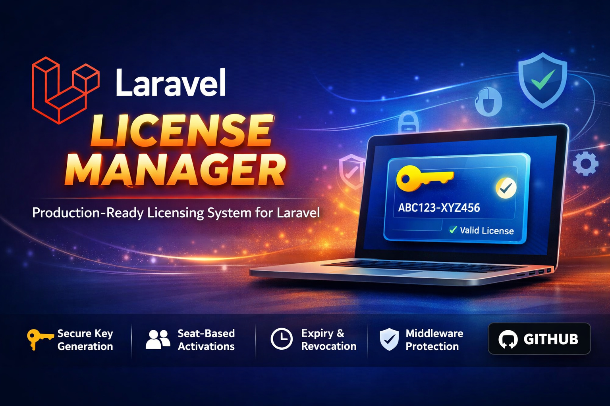

# Laravel Licensing

[](https://packagist.org/packages/devravik/laravel-licensing)
[](https://packagist.org/packages/devravik/laravel-licensing)
[](https://github.com/devravik/laravel-licensing/actions/workflows/tests.yml)
[](https://packagist.org/packages/devravik/laravel-licensing)
[](https://packagist.org/packages/devravik/laravel-licensing)

A production-ready Laravel package for generating, managing, activating, and validating software licenses  directly inside your application.

License keys are hashed before storage (never plaintext in the database), activations are seat-controlled, and the entire lifecycle  creation, validation, activation, revocation, and expiry  is covered by typed exceptions and dispatchable events.

---

## Starter Kit

**New to this package?** Check out the [Laravel Licensing Starter](https://github.com/devravik/laravel-licensing-starter)  a complete working example that demonstrates how to use this package in a real Laravel application.

The starter kit includes:
- Full license management dashboard
- User management with license assignment
- License creation, activation, and validation workflows
- API endpoints for license validation and activation
- Complete UI built with Laravel Breeze
- Demo data and examples

Perfect for understanding how to integrate this package into your own application!

---

## Requirements

| Dependency | Version |
|------------|---------|
| PHP | `^8.1` (PHP 8.2+ required for Laravel 11 / 12) |
| Laravel | `^10.0 \| ^11.0 \| ^12.0` |

---

## Installation

**1. Install via Composer**

```bash
composer require devravik/laravel-licensing
```

**2. Publish the config**

```bash
php artisan vendor:publish --tag=license-config
```

**3. Publish the migrations**

```bash
php artisan vendor:publish --tag=license-migrations
```

**4. Run the migrations**

```bash
php artisan migrate
```

The package auto-registers its service provider via Laravel's package discovery. No manual registration is required.

---

## Configuration

After publishing, the config file lives at `config/license.php`:

```php
return [
    'license_model'        => \DevRavik\LaravelLicensing\Models\License::class,
    'activation_model'     => \DevRavik\LaravelLicensing\Models\Activation::class,
    'key_length'           => env('LICENSE_KEY_LENGTH', 32),
    'hash_keys'            => env('LICENSE_HASH_KEYS', true),
    'default_expiry_days'  => env('LICENSE_DEFAULT_EXPIRY_DAYS', 365),
    'grace_period_days'    => env('LICENSE_GRACE_PERIOD_DAYS', 7),
    'license_generation'   => env('LICENSE_GENERATION', 'random'), // 'random' | 'signed'
    'signature'            => [
        'public_key'  => env('LICENSE_PUBLIC_KEY'),
        'private_key' => env('LICENSE_PRIVATE_KEY'),
    ],
];
```

| Option | Type | Default | Description |
|--------|------|---------|-------------|
| `license_model` | `string` | `License::class` | Eloquent model for licenses |
| `activation_model` | `string` | `Activation::class` | Eloquent model for activations |
| `key_length` | `int` | `32` | Length of generated license keys (chars) |
| `hash_keys` | `bool` | `true` | Hash keys with bcrypt before storage |
| `default_expiry_days` | `int\|null` | `365` | Default license duration; `null` = no expiry |
| `grace_period_days` | `int` | `7` | Days of temporary validity after expiry; `0` = disabled |
| `license_generation` | `string` | `'random'` | Generation strategy: `'random'` or `'signed'` |
| `signature.public_key` | `string\|null` | `null` | Ed25519 public key (file path or base64 string) |
| `signature.private_key` | `string\|null` | `null` | Ed25519 private key (file path or base64 string) |

**Environment variables:**

```dotenv
LICENSE_KEY_LENGTH=32
LICENSE_HASH_KEYS=true
LICENSE_DEFAULT_EXPIRY_DAYS=365
LICENSE_GRACE_PERIOD_DAYS=7
LICENSE_GENERATION=random
LICENSE_PUBLIC_KEY=
LICENSE_PRIVATE_KEY=
```

---

## Usage

### Creating a License

Use the `HasLicenses` trait on any Eloquent model that should own licenses, then build with the fluent API:

```php
// app/Models/User.php
use DevRavik\LaravelLicensing\Support\HasLicenses;

class User extends Authenticatable
{
    use HasLicenses;
}
```

```php
use DevRavik\LaravelLicensing\Facades\License;

$license = License::for($user)
    ->product('pro')
    ->seats(3)
    ->expiresInDays(365)
    ->create();

// The raw key is only available at creation time. Store or display it immediately.
$rawKey = $license->key;
```

**Builder reference:**

| Method | Description | Required |
|--------|-------------|----------|
| `for(Model $owner)` | Bind the license to an Eloquent model | Yes |
| `product(string $product)` | Set the product name or tier | Yes |
| `seats(int $count)` | Maximum activations allowed (default: 1) | No |
| `expiresInDays(int $days)` | Expiry relative to now | No |
| `expiresAt(Carbon $date)` | Explicit expiry date | No |
| `create()` | Persist and return the license | Yes |

> If neither `expiresInDays()` nor `expiresAt()` is called, the value from `config('license.default_expiry_days')` is used.

---

### Validating a License

```php
use DevRavik\LaravelLicensing\Facades\License;
use DevRavik\LaravelLicensing\Exceptions\InvalidLicenseException;
use DevRavik\LaravelLicensing\Exceptions\LicenseExpiredException;
use DevRavik\LaravelLicensing\Exceptions\LicenseRevokedException;

try {
    $license = License::validate($rawKey);
    // Valid. Check grace period if needed:
    if ($license->isInGracePeriod()) {
        // Warn: expires in $license->graceDaysRemaining() days
    }
} catch (LicenseExpiredException $e) {
    // Expired beyond grace period
} catch (LicenseRevokedException $e) {
    // Revoked
} catch (InvalidLicenseException $e) {
    // Key not found
}
```

---

### Activating a License

Bind a license to a domain, IP address, machine ID, or any identifier. Each binding consumes one seat.

```php
use DevRavik\LaravelLicensing\Facades\License;
use DevRavik\LaravelLicensing\Exceptions\SeatLimitExceededException;

try {
    $activation = License::activate($rawKey, 'app.example.com');
} catch (SeatLimitExceededException $e) {
    // All seats occupied
}
```

---

### Deactivating a License

Remove an activation to free up a seat:

```php
License::deactivate($rawKey, 'app.example.com');
```

---

### Revoking a License

Immediately and permanently invalidate a license:

```php
License::revoke($rawKey);
```

---

### Checking License Status

```php
$license = License::find($rawKey); // no exception on failure  returns null

$license->isValid();           // not revoked and not fully expired
$license->isExpired();         // past expiration date
$license->isInGracePeriod();   // expired but within grace window
$license->isRevoked();         // revoked_at is set
$license->seatsRemaining();    // available activation slots
$license->graceDaysRemaining(); // days left in grace period
$license->activations;         // Eloquent collection of current activations
```

---

## Facade Reference

| Method | Signature | Returns | Description |
|--------|-----------|---------|-------------|
| `for` | `for(Model $owner)` | `LicenseBuilder` | Begin building a license |
| `validate` | `validate(string $key)` | `License` | Validate and return license; throws on failure |
| `activate` | `activate(string $key, string $binding)` | `Activation` | Activate a license against a binding |
| `deactivate` | `deactivate(string $key, string $binding)` | `bool` | Remove an activation binding |
| `revoke` | `revoke(string $key)` | `bool` | Permanently revoke a license |
| `find` | `find(string $key)` | `License\|null` | Find a license without validation |

---

## Artisan Commands

The package provides comprehensive Artisan commands for managing licenses:

### Generate License Keys

Generate Ed25519 key pairs for signed license verification:

```bash
php artisan licensing:keys
```

**Options:**

- `--force` - Overwrite existing keys if they already exist
- `--show` - Display the generated keys in the console
- `--write` - Automatically append keys to your `.env` file

### License Status

Check package configuration and status:

```bash
php artisan license:status
```

### List Licenses

List all licenses with optional filtering:

```bash
php artisan licensing:list
php artisan licensing:list --product=pro
php artisan licensing:list --status=active
php artisan licensing:list --expired
php artisan licensing:list --revoked
```

**Options:**

- `--product` - Filter by product name
- `--owner-type` - Filter by owner model class
- `--owner-id` - Filter by owner ID
- `--status` - Filter by status (active|expired|revoked)
- `--expired` - Show only expired licenses
- `--revoked` - Show only revoked licenses
- `--per-page` - Number of licenses per page (default: 15)

### Show License

Display detailed information about a specific license:

```bash
php artisan licensing:show --key=abc123...
php artisan licensing:show --id=1
php artisan licensing:show --id=1 --full
```

**Options:**

- `--key` - License key
- `--id` - License ID
- `--full` - Show full license key (unmasked)

### Create License

Create a new license interactively or via options:

```bash
# Interactive mode
php artisan licensing:create

# Non-interactive mode
php artisan licensing:create \
    --owner-type=App\\Models\\User \
    --owner-id=1 \
    --product=pro \
    --seats=5 \
    --expires-days=365 \
    --non-interactive
```

**Options:**

- `--owner-type` - Owner model class (e.g., `App\\Models\\User`)
- `--owner-id` - Owner model ID
- `--product` - Product name or tier
- `--seats` - Number of seats (default: 1)
- `--expires-days` - Days until expiration (leave empty for never)
- `--non-interactive` - Skip interactive prompts

### Revoke License

Revoke a license by key or ID:

```bash
php artisan licensing:revoke --key=abc123...
php artisan licensing:revoke --id=1 --force
```

**Options:**

- `--key` - License key
- `--id` - License ID
- `--force` - Skip confirmation prompt

### Activate License

Activate a license for a binding:

```bash
php artisan licensing:activate --key=abc123... --binding=domain.com
php artisan licensing:activate --id=1 --binding=192.168.1.1
```

**Options:**

- `--key` - License key
- `--id` - License ID
- `--binding` - Activation binding (domain, IP, machine ID, etc.)

### Deactivate License

Remove an activation binding:

```bash
php artisan licensing:deactivate --key=abc123... --binding=domain.com
php artisan licensing:deactivate --id=1 --binding=192.168.1.1
```

**Options:**

- `--key` - License key
- `--id` - License ID
- `--binding` - Binding to remove (if omitted, shows list to choose from)

### License Statistics

Display license and activation statistics:

```bash
php artisan licensing:stats
php artisan licensing:stats --product=pro
```

**Options:**

- `--product` - Filter statistics by product

**Output includes:**

- Total, active, expired, and revoked license counts
- Total, used, and available seat counts
- Total activation count
- Seat usage percentage

---

## Middleware

The package ships two middleware aliases that are registered automatically.

### Protect routes requiring a specific product

```php
// routes/api.php
Route::middleware('license:pro')->group(function () {
    Route::get('/pro/dashboard', [ProDashboardController::class, 'index']);
});

Route::middleware('license:enterprise')->group(function () {
    Route::get('/enterprise/analytics', [AnalyticsController::class, 'index']);
});
```

### Protect routes requiring any valid license

```php
Route::middleware('license.valid')->group(function () {
    Route::get('/app', [AppController::class, 'index']);
});
```

The middleware reads the license key from the `X-License-Key` request header (or `license_key` query/body parameter).

### Middleware Responses

| Failure Reason | HTTP Status |
|----------------|-------------|
| No key provided | `401 Unauthorized` |
| Key not found | `404 Not Found` |
| Revoked or expired | `403 Forbidden` |
| Wrong product tier | `403 Forbidden` |
| Seat limit exceeded | `422 Unprocessable Entity` |

For `Accept: application/json` requests the middleware returns:

```json
{
    "error": "license_check_failed",
    "message": "The provided license key is invalid."
}
```

For web requests, `abort()` is called with the appropriate status code.

You can customise the response by extending `AbstractLicenseMiddleware` and overriding `denyResponse()`.

---

## Events

| Event | Fired When | Properties |
|-------|-----------|------------|
| `LicenseCreated` | `create()` is called | `$event->license` |
| `LicenseActivated` | `activate()` is called | `$event->license`, `$event->activation` |
| `LicenseDeactivated` | `deactivate()` is called | `$event->license`, `$event->binding` |
| `LicenseRevoked` | `revoke()` is called | `$event->license` |
| `LicenseExpired` | Dispatched manually from a scheduled command | `$event->license` |

`LicenseExpired` is intentionally **not** dispatched automatically  it should be fired from a scheduled command so you control when and how expiration is processed:

```php
// routes/console.php  (Laravel 11+)
use Illuminate\Support\Facades\Schedule;
use DevRavik\LaravelLicensing\Models\License;
use DevRavik\LaravelLicensing\Events\LicenseExpired;

Schedule::call(function () {
    License::query()
        ->whereNull('revoked_at')
        ->whereNotNull('expires_at')
        ->where('expires_at', '<=', now()->subDays(config('license.grace_period_days')))
        ->each(fn ($license) => event(new LicenseExpired($license)));
})->daily();
```

### Registering Listeners

```php
// app/Providers/EventServiceProvider.php
use DevRavik\LaravelLicensing\Events\LicenseCreated;
use DevRavik\LaravelLicensing\Events\LicenseActivated;
use DevRavik\LaravelLicensing\Events\LicenseRevoked;

protected $listen = [
    LicenseCreated::class  => [SendLicenseKeyEmail::class],
    LicenseActivated::class => [LogActivation::class],
    LicenseRevoked::class  => [NotifyUserOfRevocation::class],
];
```

---

## Exceptions

All exceptions extend `LicenseManagerException`, so you can catch them collectively or individually.

| Exception | Thrown When | `getStatusCode()` |
|-----------|-------------|-------------------|
| `InvalidLicenseException` | Key does not match any record | `404` |
| `LicenseExpiredException` | Expired beyond grace period | `403` |
| `LicenseRevokedException` | License has been revoked | `403` |
| `SeatLimitExceededException` | All activation seats occupied | `422` |
| `LicenseAlreadyActivatedException` | Binding already exists for this license | `409` |
| `LicenseManagerException` | Base exception (catch-all) | `500` |

### Global Exception Handler

```php
// bootstrap/app.php (Laravel 11+)
use DevRavik\LaravelLicensing\Exceptions\LicenseManagerException;

$exceptions->render(function (LicenseManagerException $e, $request) {
    if ($request->expectsJson()) {
        return response()->json([
            'error'   => 'license_error',
            'message' => $e->getMessage(),
        ], $e->getStatusCode());
    }

    return redirect()->route('license.invalid');
});
```

---

## Database Schema

### `licenses`

| Column | Type | Notes |
|--------|------|-------|
| `id` | `bigint` PK | Auto-increment |
| `key` | `varchar(255)` | Bcrypt hash of the raw key (or plaintext if `hash_keys=false`) |
| `lookup_token` | `varchar(64)` nullable, indexed | SHA-256 of raw key; used for O(log n) pre-filtering before bcrypt check |
| `product` | `varchar(255)` indexed | Product name or tier |
| `owner_id` | `bigint` indexed | Polymorphic FK |
| `owner_type` | `varchar(255)` | Polymorphic type |
| `seats` | `int` default `1` | Maximum activations allowed |
| `expires_at` | `timestamp` nullable | Expiration timestamp |
| `revoked_at` | `timestamp` nullable | Set when revoked; `null` = active |
| `created_at` / `updated_at` | `timestamp` | Laravel timestamps |

### `license_activations`

| Column | Type | Notes |
|--------|------|-------|
| `id` | `bigint` PK | Auto-increment |
| `license_id` | `bigint` FK | Cascades on delete |
| `binding` | `varchar(255)` | Domain, IP, machine ID, or custom string |
| `activated_at` | `timestamp` | When activation occurred |
| `created_at` / `updated_at` | `timestamp` | Laravel timestamps |

A unique composite index on `(license_id, binding)` prevents duplicate activations.

---

## Advanced Usage

### Polymorphic Ownership

Licenses can belong to any model  not just users. Add the `HasLicenses` trait:

```php
// app/Models/Team.php
use DevRavik\LaravelLicensing\Support\HasLicenses;

class Team extends Model
{
    use HasLicenses;
}

// Create a team license
$license = License::for($team)
    ->product('team-plan')
    ->seats(25)
    ->expiresInDays(365)
    ->create();
```

### Querying Licenses

```php
// All licenses for a user
$user->licenses;

// Active licenses for a product
$user->licenses()
    ->where('product', 'pro')
    ->whereNull('revoked_at')
    ->where(function ($q) {
        $q->whereNull('expires_at')->orWhere('expires_at', '>', now());
    })
    ->get();
```

### Custom License Model

```php
// app/Models/License.php
namespace App\Models;

use DevRavik\LaravelLicensing\Models\License as BaseLicense;

class License extends BaseLicense
{
    public function getIsPremiumAttribute(): bool
    {
        return in_array($this->product, ['pro', 'enterprise']);
    }
}
```

Update `config/license.php`:

```php
'license_model' => \App\Models\License::class,
```

### Custom Activation Model

```php
namespace App\Models;

use DevRavik\LaravelLicensing\Models\Activation as BaseActivation;

class Activation extends BaseActivation
{
    // Add custom attributes or relationships
}
```

```php
'activation_model' => \App\Models\Activation::class,
```

### Using in Controllers

```php
public function activate(Request $request)
{
    $request->validate(['key' => 'required|string', 'binding' => 'required|string']);

    try {
        $activation = License::activate($request->key, $request->binding);

        return response()->json(['activated' => true, 'binding' => $activation->binding]);
    } catch (LicenseManagerException $e) {
        return response()->json(['error' => $e->getMessage()], $e->getStatusCode());
    }
}
```

---

## Security

- **Key generation** uses `random_bytes()`  a cryptographically secure CSPRNG. No `openssl` extension required.
- **Key storage**  keys are hashed with bcrypt via Laravel's `Hash` facade before being written to the database. The raw key is never persisted. A SHA-256 `lookup_token` is stored alongside to enable fast lookups without a full-table bcrypt scan.
- **Key comparison** uses `Hash::check()`, which is resistant to timing attacks.
- **One-time retrieval**  the raw key is available only during the `create()` call. Transmit it to the end user immediately over a secure channel (HTTPS).
- **Signature-based verification (v1.1+)**  optional Ed25519 signature-based license verification for offline and tamper-resistant validation scenarios. When enabled, license keys contain cryptographically signed payloads that can be verified without database access.

**Production checklist:**

1. Keep `hash_keys = true`  never disable in production.
2. Use HTTPS for all endpoints that transmit or receive license keys.
3. Rate-limit validation and activation endpoints to prevent brute-force guessing.
4. Use the provided events to audit all license operations.
5. Never log raw license keys.
6. For signed licenses, store private keys securely and never commit them to version control.

---

## Testing

The package test suite runs against MySQL:

```bash
# MySQL
TEST_DB_DRIVER=mysql \
TEST_DB_HOST=127.0.0.1 \
TEST_DB_PORT=3306 \
TEST_DB_DATABASE=laravel_licensing_test \
TEST_DB_USERNAME=root \
TEST_DB_PASSWORD=secret \
vendor/bin/phpunit
```

Create the MySQL test database first:

```bash
mysql -u root -e "CREATE DATABASE IF NOT EXISTS laravel_licensing_test;"
```

### Example Test

```php
use DevRavik\LaravelLicensing\Facades\License;
use DevRavik\LaravelLicensing\Exceptions\SeatLimitExceededException;

public function test_seat_limit_is_enforced(): void
{
    $license = License::for(User::factory()->create())
        ->product('pro')
        ->seats(2)
        ->create();

    $key = $license->key;

    License::activate($key, 'domain-1.com');
    License::activate($key, 'domain-2.com');

    $this->expectException(SeatLimitExceededException::class);
    License::activate($key, 'domain-3.com');
}
```

---

## Signature-Based License Verification (v1.1+)

v1.1 adds optional Ed25519 signature-based license verification for offline and tamper-resistant validation scenarios.

### Enabling Signed Licenses

Set `LICENSE_GENERATION=signed` in your `.env` file and provide Ed25519 key pair:

```dotenv
LICENSE_GENERATION=signed
LICENSE_PUBLIC_KEY=base64_encoded_public_key
LICENSE_PRIVATE_KEY=base64_encoded_private_key
```

Or use file paths:

```dotenv
LICENSE_GENERATION=signed
LICENSE_PUBLIC_KEY=/path/to/public.key
LICENSE_PRIVATE_KEY=/path/to/private.key
```

### Generating Key Pairs

Generate an Ed25519 key pair using the Artisan command:

```bash
php artisan licensing:keys
```

This will generate a new key pair and display the values to add to your `.env` file.

**Options:**

- `--force` - Overwrite existing keys if they already exist
- `--show` - Display the generated keys in the console
- `--write` - Automatically append keys to your `.env` file

**Example:**

```bash
# Generate and display keys
php artisan licensing:keys --show

# Generate and auto-write to .env
php artisan licensing:keys --write

# Overwrite existing keys
php artisan licensing:keys --force
```

**Manual Generation (Alternative):**

If you prefer to generate keys manually using PHP:

```php
$keypair = sodium_crypto_sign_keypair();
$publicKey = base64_encode(sodium_crypto_sign_publickey($keypair));
$privateKey = base64_encode(sodium_crypto_sign_secretkey($keypair));

// Store these securely
echo "Public Key: {$publicKey}\n";
echo "Private Key: {$privateKey}\n";
```

### How It Works

When `license_generation` is set to `'signed'`:

1. **Generation**: License keys are created by signing a JSON payload (product, seats, expiry, owner info) with the private key using Ed25519.
2. **Format**: Keys are base64-encoded strings containing `base64(message . '.' . signature)`.
3. **Verification**: During validation, the signature is verified using the public key before database lookup.
4. **Storage**: Signed licenses are still stored in the database (hashed) for seat management, activations, and revocation tracking.

### Benefits

- **Offline validation**: Verify license authenticity without database access
- **Tamper resistance**: Any modification to the license key invalidates the signature
- **Cryptographic proof**: Ed25519 provides strong cryptographic guarantees
- **Backward compatible**: Default behavior remains random generation

### Example

```php
// Generate signed license
$license = License::for($user)
    ->product('pro')
    ->seats(5)
    ->expiresInDays(365)
    ->create();

// Validate (signature verified automatically)
$validated = License::validate($license->key);
```

---

## Changelog

Please see [CHANGELOG.md](CHANGELOG.md) for a full release history.

---

## Contributing

Contributions are welcome. Please:

1. Fork the repository and create a feature branch from `main`.
2. Write tests for all new functionality.
3. Follow [PSR-12](https://www.php-fig.org/psr/psr-12/) and run `composer format` before submitting.
4. Ensure `composer test` and `composer analyse` pass.
5. Open a pull request with a clear description of the change.

Pull requests without tests will not be merged.

When reporting a bug, please include your PHP and Laravel version, the package version, steps to reproduce, and any relevant stack traces.

---

## Security Vulnerabilities

Please do **not** report security vulnerabilities via GitHub Issues. Email `dev.ravikgupt@gmail.com` with the subject line `[SECURITY] devravik/laravel-licensing  <brief description>`. You will receive a response within 48 hours.

See [SECURITY.md](SECURITY.md) for details.

---

## Maintainer

**Ravi K Gupta**

- **Website**: [devravik.github.io](https://devravik.github.io/)
- **Email**: `dev.ravikgupt@gmail.com`
- **LinkedIn**: [linkedin.com/in/ravi-k-dev](https://www.linkedin.com/in/ravi-k-dev)
- **GitHub**: [github.com/devravik](https://github.com/devravik)

---

## License

The MIT License (MIT). Please see [LICENSE](LICENSE) for more information.
