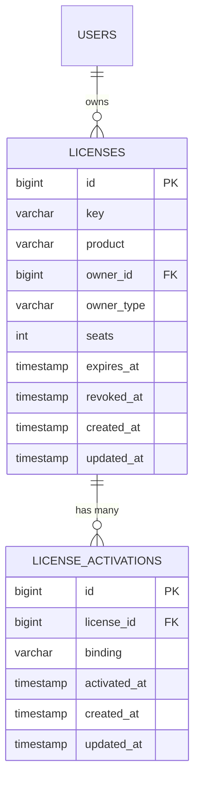
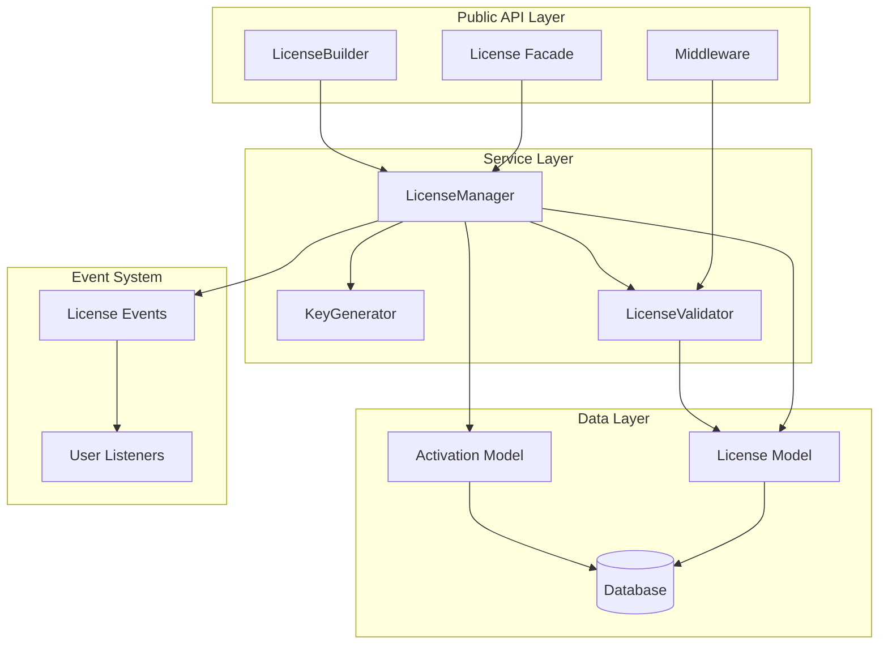

# Laravel Licensing

A production-ready, Laravel-native license management package inspired by the developer experience of [spatie/laravel-permission](https://github.com/spatie/laravel-permission).

Generate, manage, activate, and validate software licenses directly inside your Laravel application — cleanly and securely.

[](https://packagist.org/packages/devravik/laravel-licensing)
[](https://packagist.org/packages/devravik/laravel-licensing)
[](https://packagist.org/packages/devravik/laravel-licensing)

---

## Table of Contents

- [Introduction](#introduction)
- [Features](#features)
- [Requirements](#requirements)
- [Installation](#installation)
- [Configuration](#configuration)
- [Quick Start](#quick-start)
- [Usage](#usage)
  - [Creating a License](#creating-a-license)
  - [Validating a License](#validating-a-license)
  - [Activating a License](#activating-a-license)
  - [Deactivating a Binding](#deactivating-a-binding)
  - [Revoking a License](#revoking-a-license)
  - [Checking License Status](#checking-license-status)
- [API Reference](#api-reference)
- [Seat-Based Activation](#seat-based-activation)
- [Secure License Storage](#secure-license-storage)
- [Middleware](#middleware)
- [Grace Period Support](#grace-period-support)
- [Events](#events)
- [Database Schema](#database-schema)
- [Error Handling and Exceptions](#error-handling-and-exceptions)
- [Security Considerations](#security-considerations)
- [Advanced Usage](#advanced-usage)
- [Extending the Package](#extending-the-package)
- [Testing](#testing)
- [Architecture](#architecture)
- [Best Practices](#best-practices)
- [Troubleshooting](#troubleshooting)
- [Roadmap](#roadmap)
- [Versioning](#versioning)
- [Contributing](#contributing)
- [Support](#support)
- [License](#license)

---

## Introduction

Laravel Licensing provides a complete solution for managing software licenses within Laravel applications. Whether you are building a SaaS platform, distributing downloadable software, managing API access, or implementing multi-seat product licensing, this package gives you a clean, secure, and extensible foundation.

The package handles the full license lifecycle: generation, validation, activation (with seat limits), expiration, grace periods, and revocation. All license keys are hashed before storage, ensuring that sensitive data is never exposed in plaintext — even if the database is compromised.

### Getting Started

If you're new to this package, start with:

- **[Installation](#installation)** to pull in the package and publish config/migrations.
- **[Quick Start](#quick-start)** for an end-to-end example of creating, validating, and activating a license.
- **[Usage](#usage)** for more detailed APIs and patterns.

---

## Features

- **Secure license key generation** using cryptographically random strings
- **Hashed license storage** — no plaintext keys are persisted in the database
- **Product-based licenses** — associate licenses with specific product tiers or SKUs
- **Expiry support** — set expiration dates with configurable defaults
- **Seat-based activations** — control how many devices, domains, or identifiers can activate a single license
- **Flexible binding support** — bind activations to domains, IP addresses, machine identifiers, or any custom string
- **License revocation** — immediately invalidate any license
- **Grace period handling** — allow temporary access after license expiration
- **Middleware for route protection** — guard routes by product type or general license validity
- **Eloquent integration** — licenses and activations are standard Eloquent models with full relationship support
- **Lifecycle events** — hook into creation, activation, revocation, and expiration events
- **Publishable configuration and migrations** — full control over schema and behavior
- **Fully testable and extensible** — swap models, override logic, and test in isolation

---

## Requirements

| Dependency       | Version           |
|------------------|-------------------|
| PHP              | >= 8.1            |
| Laravel          | >= 10.x           |
| Database         | MySQL 5.7+ / PostgreSQL 10+ / SQLite 3.8.8+ |

**Required PHP extensions:**

- `openssl` (for secure key generation)
- `mbstring`
- `pdo` (with the appropriate driver for your database)

---

## Installation

### Step 1: Install via Composer

```bash
composer require devravik/laravel-licensing
```

For a specific version:

```bash
composer require devravik/laravel-licensing:^1.0
```

### Step 2: Publish Configuration

```bash
php artisan vendor:publish --tag=license-config
```

This publishes the configuration file to `config/license.php`.

### Step 3: Publish Migrations

```bash
php artisan vendor:publish --tag=license-migrations
```

This publishes the migration files to your `database/migrations` directory, allowing you to customize the schema before running them.

### Step 4: Run Migrations

```bash
php artisan migrate
```

### Step 5: Verify Installation

You can verify the package is installed and configured correctly by running:

```bash
php artisan license:status
```

Or by checking that the configuration file exists:

```bash
php artisan config:show license
```

---

## Configuration

After publishing, the configuration file is located at `config/license.php`.

```php
// config/license.php

return [

    /*
    |--------------------------------------------------------------------------
    | License Model
    |--------------------------------------------------------------------------
    |
    | The Eloquent model used to represent a license. You may replace this
    | with your own model as long as it extends the base License model or
    | implements the LicenseContract interface.
    |
    */
    'license_model' => \App\Models\License::class,

    /*
    |--------------------------------------------------------------------------
    | Activation Model
    |--------------------------------------------------------------------------
    |
    | The Eloquent model used to represent a license activation (seat binding).
    | You may replace this with your own model as long as it extends the base
    | Activation model or implements the ActivationContract interface.
    |
    */
    'activation_model' => \App\Models\Activation::class,

    /*
    |--------------------------------------------------------------------------
    | Key Length
    |--------------------------------------------------------------------------
    |
    | The length of generated license keys in characters. Longer keys provide
    | more entropy and are harder to guess. The default of 32 characters
    | provides 128 bits of entropy when using hexadecimal encoding.
    |
    | Minimum recommended: 16 | Default: 32 | Maximum: 64
    |
    */
    'key_length' => 32,

    /*
    |--------------------------------------------------------------------------
    | Hash Keys
    |--------------------------------------------------------------------------
    |
    | When enabled, license keys are hashed (using bcrypt or the configured
    | hashing driver) before being stored in the database. This ensures that
    | plaintext keys are never persisted. The raw key is returned only once
    | during creation.
    |
    | WARNING: Disabling this option stores keys in plaintext and is strongly
    | discouraged in production environments.
    |
    */
    'hash_keys' => true,

    /*
    |--------------------------------------------------------------------------
    | Default Expiry (Days)
    |--------------------------------------------------------------------------
    |
    | The default number of days before a newly created license expires. This
    | value is used when no explicit expiry is set during license creation.
    | Set to null for licenses that never expire by default.
    |
    */
    'default_expiry_days' => 365,

    /*
    |--------------------------------------------------------------------------
    | Grace Period (Days)
    |--------------------------------------------------------------------------
    |
    | The number of days after a license expires during which it remains
    | temporarily valid. This is useful for subscription-based systems where
    | you want to give users time to renew before cutting off access.
    |
    | Set to 0 to disable grace periods entirely.
    |
    */
    'grace_period_days' => 7,

];
```

### Configuration Options Summary

| Option               | Type     | Default                        | Description                                                  |
|----------------------|----------|--------------------------------|--------------------------------------------------------------|
| `license_model`      | `string` | `App\Models\License::class`    | Eloquent model class for licenses                            |
| `activation_model`   | `string` | `App\Models\Activation::class` | Eloquent model class for activations                         |
| `key_length`         | `int`    | `32`                           | Length of generated license keys                             |
| `hash_keys`          | `bool`   | `true`                         | Whether to hash keys before storage                          |
| `default_expiry_days`| `int`    | `365`                          | Default license duration in days (null for no expiry)        |
| `grace_period_days`  | `int`    | `7`                            | Days of temporary validity after expiration (0 to disable)   |

### Environment Variables

You may override configuration values using environment variables in your `.env` file:

```dotenv
LICENSE_KEY_LENGTH=32
LICENSE_HASH_KEYS=true
LICENSE_DEFAULT_EXPIRY_DAYS=365
LICENSE_GRACE_PERIOD_DAYS=7
```

---

## Quick Start

This section demonstrates a minimal end-to-end workflow: creating a license, validating it, and activating it against a domain.

```php
use DevRavik\LaravelLicensing\Facades\License;
use App\Models\User;

// 1. Create a license for a user
$user = User::find(1);

$license = License::for($user)
    ->product('pro')
    ->expiresInDays(365)
    ->seats(3)
    ->create();

// The raw license key is only available at creation time.
// Store or display it to the user immediately.
$rawKey = $license->key;

// 2. Validate the license key
try {
    $validatedLicense = License::validate($rawKey);
    // License is valid — proceed.
} catch (\DevRavik\LaravelLicensing\Exceptions\InvalidLicenseException $e) {
    // License is invalid, expired, or revoked.
}

// 3. Activate the license against a domain
try {
    License::activate($rawKey, 'app.example.com');
    // Activation successful.
} catch (\YourVendor\LicenseManager\Exceptions\SeatLimitExceededException $e) {
    // All available seats are occupied.
}
```

---

## Usage

### Creating a License

Use the fluent builder to create a license and associate it with a user (or any Eloquent model that uses the `HasLicenses` trait).

```php
use DevRavik\LaravelLicensing\Facades\License;

$license = License::for($user)
    ->product('enterprise')
    ->expiresInDays(365)
    ->seats(10)
    ->create();

// The raw key is returned only at this point.
// After this, only the hashed version exists in the database.
echo $license->key; // e.g., "a1b2c3d4e5f6..."
```

**Builder methods:**

| Method                | Description                                     | Required |
|-----------------------|-------------------------------------------------|----------|
| `for($user)`          | Associate the license with a user or model       | Yes      |
| `product(string)`     | Set the product name or tier                     | Yes      |
| `expiresInDays(int)`  | Set expiration in days from now                  | No       |
| `expiresAt(Carbon)`   | Set an explicit expiration date                  | No       |
| `seats(int)`          | Set the maximum number of activations allowed    | No       |
| `create()`            | Persist the license and return the model         | Yes      |

If `expiresInDays()` or `expiresAt()` is not called, the value from `config('license.default_expiry_days')` is used.

If `seats()` is not called, the license defaults to a single seat (1 activation).

### Validating a License

Validate a license key to confirm it exists, has not been revoked, and has not expired beyond its grace period.

```php
use DevRavik\LaravelLicensing\Facades\License;
use DevRavik\LaravelLicensing\Exceptions\InvalidLicenseException;
use DevRavik\LaravelLicensing\Exceptions\LicenseExpiredException;
use DevRavik\LaravelLicensing\Exceptions\LicenseRevokedException;

try {
    $license = License::validate($key);

    if ($license->isExpired() && $license->isInGracePeriod()) {
        // License expired but within grace period — consider warning the user.
    }

    // License is valid.
} catch (LicenseExpiredException $e) {
    // License has expired beyond the grace period.
} catch (LicenseRevokedException $e) {
    // License has been revoked.
} catch (InvalidLicenseException $e) {
    // License key does not match any record.
}
```

### Activating a License

Activate a license by binding it to an identifier (domain, IP address, machine ID, or any arbitrary string).

```php
use DevRavik\LaravelLicensing\Facades\License;
use DevRavik\LaravelLicensing\Exceptions\SeatLimitExceededException;
use DevRavik\LaravelLicensing\Exceptions\InvalidLicenseException;

try {
    $activation = License::activate($key, 'client.example.com');
    // Activation stored successfully.
} catch (SeatLimitExceededException $e) {
    // The license has reached its maximum number of activations.
    // $e->getMessage() provides details.
} catch (InvalidLicenseException $e) {
    // The provided key is not valid.
}
```

**Supported binding types:**

| Binding Type   | Example Value            | Use Case                      |
|----------------|--------------------------|-------------------------------|
| Domain         | `app.example.com`        | Web application licensing     |
| IP Address     | `203.0.113.42`           | Server licensing              |
| Machine ID     | `hw-uuid-abc123`         | Desktop software licensing    |
| Custom         | `tenant-42`              | Multi-tenant SaaS platforms   |

### Deactivating a Binding

Remove an existing activation to free up a seat.

```php
use DevRavik\LaravelLicensing\Facades\License;

License::deactivate($key, 'old-domain.example.com');
// The seat is now available for a new activation.
```

### Revoking a License

Revoke a license to immediately and permanently invalidate it. All existing activations are also rendered invalid.

```php
use YourVendor\LicenseManager\Facades\License;

License::revoke($key);
// The license is now revoked. Any subsequent validate() or activate() call will fail.
```

### Checking License Status

Inspect the current state of a license programmatically.

```php
$license = License::validate($key);

$license->isValid();          // true if active and not expired
$license->isExpired();        // true if past expiration date
$license->isInGracePeriod();  // true if expired but within grace window
$license->isRevoked();        // true if revoked
$license->seatsRemaining();   // number of available activation slots
$license->activations;        // Eloquent collection of active bindings
```

---

## API Reference

### License Facade Methods

| Method | Signature | Return Type | Description |
|--------|-----------|-------------|-------------|
| `for` | `for(Model $owner)` | `LicenseBuilder` | Begin building a license for the given model |
| `validate` | `validate(string $key)` | `License` | Validate a key and return the license instance |
| `activate` | `activate(string $key, string $binding)` | `Activation` | Activate a license against a binding identifier |
| `deactivate` | `deactivate(string $key, string $binding)` | `bool` | Remove an activation binding from a license |
| `revoke` | `revoke(string $key)` | `bool` | Revoke a license permanently |
| `find` | `find(string $key)` | `License\|null` | Find a license by key without validation |

### LicenseBuilder Methods

| Method | Signature | Return Type | Description |
|--------|-----------|-------------|-------------|
| `product` | `product(string $product)` | `LicenseBuilder` | Set the product identifier |
| `expiresInDays` | `expiresInDays(int $days)` | `LicenseBuilder` | Set expiry relative to now |
| `expiresAt` | `expiresAt(Carbon $date)` | `LicenseBuilder` | Set an explicit expiry date |
| `seats` | `seats(int $count)` | `LicenseBuilder` | Set the maximum activation count |
| `create` | `create()` | `License` | Persist and return the license |

### License Model Properties

| Property | Type | Description |
|----------|------|-------------|
| `id` | `int` | Primary key |
| `key` | `string` | Hashed license key (raw key only available at creation) |
| `product` | `string` | Product name or tier |
| `owner_id` | `int` | Foreign key to the owning model |
| `owner_type` | `string` | Polymorphic type of the owning model |
| `seats` | `int` | Maximum number of allowed activations |
| `expires_at` | `Carbon\|null` | Expiration timestamp |
| `revoked_at` | `Carbon\|null` | Revocation timestamp (null if active) |
| `created_at` | `Carbon` | Creation timestamp |
| `updated_at` | `Carbon` | Last update timestamp |

### License Model Methods

| Method | Return Type | Description |
|--------|-------------|-------------|
| `isValid()` | `bool` | Whether the license is currently valid |
| `isExpired()` | `bool` | Whether the license has passed its expiration date |
| `isInGracePeriod()` | `bool` | Whether the license is expired but within the grace window |
| `isRevoked()` | `bool` | Whether the license has been revoked |
| `seatsRemaining()` | `int` | Number of activation slots still available |
| `owner()` | `MorphTo` | Polymorphic relationship to the owning model |
| `activations()` | `HasMany` | Relationship to activation records |

---

## Seat-Based Activation

Each license can define a maximum number of concurrent activations (seats). This is useful for products that allow installation on multiple devices, domains, or environments.

```php
$license = License::for($user)
    ->product('pro')
    ->seats(5)
    ->create();
```

Each call to `License::activate($key, $binding)` consumes one seat. When all seats are occupied, further activation attempts throw a `SeatLimitExceededException`.

**Seat management operations:**

```php
// Check remaining seats
$remaining = $license->seatsRemaining(); // e.g., 3

// List current activations
$activations = $license->activations; // Eloquent Collection

// Remove an activation to free a seat
License::deactivate($key, 'old-binding');
```

Activations are stored in a dedicated `license_activations` table and are related to the license via a foreign key.

---

## Secure License Storage

License keys are hashed using Laravel's `Hash` facade (bcrypt by default) before being stored in the database. This design ensures:

- **No plaintext exposure:** Even if the database is compromised, license keys cannot be read.
- **Secure validation:** Keys are compared using `Hash::check()`, which is timing-attack resistant.
- **One-time retrieval:** The raw key is returned only during the `create()` call. It is the caller's responsibility to display or transmit the key to the end user at that point.

This behavior is controlled by the `hash_keys` configuration option. While it can be disabled for development or debugging purposes, it is **strongly recommended** to keep hashing enabled in production.

---

## Middleware

The package provides middleware to protect routes based on license validity.

### Product-Specific Middleware

Restrict access to routes that require a specific product license:

```php
// In your route file (e.g., routes/web.php or routes/api.php)

use Illuminate\Support\Facades\Route;

Route::middleware(['license:pro'])->group(function () {
    Route::get('/pro/dashboard', [ProDashboardController::class, 'index']);
    Route::get('/pro/reports', [ProReportController::class, 'index']);
});

Route::middleware(['license:enterprise'])->group(function () {
    Route::get('/enterprise/analytics', [AnalyticsController::class, 'index']);
});
```

### General License Validation Middleware

Ensure the user has any valid license, regardless of product:

```php
Route::middleware('license.valid')->group(function () {
    Route::get('/licensed-area', [LicensedController::class, 'index']);
});
```

### Middleware Registration

Register the middleware in your application's HTTP kernel or bootstrap file:

```php
// Laravel 11+ (bootstrap/app.php)
->withMiddleware(function (Middleware $middleware) {
    $middleware->alias([
        'license' => \DevRavik\LaravelLicensing\Http\Middleware\CheckLicense::class,
        'license.valid' => \DevRavik\LaravelLicensing\Http\Middleware\CheckValidLicense::class,
    ]);
})

// Laravel 10 (app/Http/Kernel.php)
protected $middlewareAliases = [
    // ...
    'license' => \DevRavik\LaravelLicensing\Http\Middleware\CheckLicense::class,
    'license.valid' => \DevRavik\LaravelLicensing\Http\Middleware\CheckValidLicense::class,
];
```

### Middleware Behavior

When a request fails the license check, the middleware will:

1. Return a `403 Forbidden` response for web requests.
2. Return a JSON error response for API requests (`Accept: application/json`).

You can customize this behavior by extending the middleware classes.

---

## Grace Period Support

When a license expires, it can optionally enter a grace period during which it remains temporarily valid. This is particularly useful for subscription-based systems where users should have time to renew before losing access.

**How it works:**

1. A license expires at its `expires_at` timestamp.
2. During the grace period (configured via `grace_period_days`), calls to `License::validate()` still return a valid license.
3. You can check whether a license is in its grace period using `$license->isInGracePeriod()`.
4. After the grace period ends, the license is fully expired and validation will throw a `LicenseExpiredException`.

**Example: Conditional feature access during grace period:**

```php
$license = License::validate($key);

if ($license->isInGracePeriod()) {
    // Show a renewal warning to the user.
    // Optionally restrict certain premium features.
    session()->flash('warning', 'Your license has expired. Please renew within '
        . $license->graceDaysRemaining() . ' days to avoid service interruption.');
}
```

To disable grace periods entirely, set `grace_period_days` to `0` in the configuration.

---

## Events

The package dispatches events at key points in the license lifecycle. You can listen for these events to trigger notifications, logging, analytics, or any custom business logic.

### Available Events

| Event Class | Fired When | Payload |
|-------------|------------|---------|
| `LicenseCreated` | A new license is created | `$event->license` |
| `LicenseActivated` | A license is activated against a binding | `$event->license`, `$event->activation` |
| `LicenseDeactivated` | An activation binding is removed | `$event->license`, `$event->binding` |
| `LicenseRevoked` | A license is revoked | `$event->license` |
| `LicenseExpired` | A license passes its expiration date | `$event->license` |

### Registering Listeners

**Using EventServiceProvider:**

```php
// app/Providers/EventServiceProvider.php

use YourVendor\LicenseManager\Events\LicenseCreated;
use YourVendor\LicenseManager\Events\LicenseActivated;
use YourVendor\LicenseManager\Events\LicenseRevoked;
use YourVendor\LicenseManager\Events\LicenseExpired;

protected $listen = [
    LicenseCreated::class => [
        SendLicenseKeyNotification::class,
    ],
    LicenseActivated::class => [
        LogActivation::class,
    ],
    LicenseRevoked::class => [
        NotifyUserOfRevocation::class,
    ],
    LicenseExpired::class => [
        SendRenewalReminder::class,
    ],
];
```

**Using closures:**

```php
use Illuminate\Support\Facades\Event;
use YourVendor\LicenseManager\Events\LicenseActivated;

Event::listen(LicenseActivated::class, function (LicenseActivated $event) {
    logger()->info('License activated', [
        'license_id' => $event->license->id,
        'binding'    => $event->activation->binding,
        'product'    => $event->license->product,
    ]);
});
```

---

## Database Schema

The package creates two tables: `licenses` and `license_activations`.

### licenses

| Column        | Type                | Description                                    |
|---------------|---------------------|------------------------------------------------|
| `id`          | `bigint` (PK)       | Auto-incrementing primary key                  |
| `key`         | `varchar(255)`      | Hashed license key                             |
| `product`     | `varchar(255)`      | Product name or tier                           |
| `owner_id`    | `bigint` (index)    | Polymorphic foreign key to the owning model    |
| `owner_type`  | `varchar(255)`      | Polymorphic type string                        |
| `seats`       | `int` (default: 1)  | Maximum allowed activations                    |
| `expires_at`  | `timestamp` (nullable) | When the license expires                    |
| `revoked_at`  | `timestamp` (nullable) | When the license was revoked (null = active)|
| `created_at`  | `timestamp`         | Record creation time                           |
| `updated_at`  | `timestamp`         | Record last update time                        |

**Indexes:**

- Primary key on `id`
- Index on `key` for lookup performance
- Composite index on `(owner_id, owner_type)` for polymorphic queries
- Index on `product` for product-based filtering

### license_activations

| Column        | Type                | Description                                    |
|---------------|---------------------|------------------------------------------------|
| `id`          | `bigint` (PK)       | Auto-incrementing primary key                  |
| `license_id`  | `bigint` (FK, index)| Foreign key to `licenses.id`                   |
| `binding`     | `varchar(255)`      | The domain, IP, machine ID, or custom identifier |
| `activated_at`| `timestamp`         | When the activation occurred                   |
| `created_at`  | `timestamp`         | Record creation time                           |
| `updated_at`  | `timestamp`         | Record last update time                        |

**Indexes:**

- Primary key on `id`
- Foreign key on `license_id` referencing `licenses.id` (cascade on delete)
- Unique composite index on `(license_id, binding)` to prevent duplicate activations

### Entity Relationship Diagram



---

## Error Handling and Exceptions

The package throws specific exceptions for different failure scenarios. All exceptions extend `LicenseManagerException`, allowing you to catch them collectively or individually.

### Exception Classes

| Exception | Thrown When | HTTP Status |
|-----------|------------|-------------|
| `InvalidLicenseException` | The provided key does not match any license record | 404 |
| `LicenseExpiredException` | The license has expired beyond the grace period | 403 |
| `LicenseRevokedException` | The license has been revoked | 403 |
| `SeatLimitExceededException` | All activation seats for the license are occupied | 422 |
| `LicenseAlreadyActivatedException` | The same binding already exists for this license | 409 |
| `LicenseManagerException` | Base exception for all package-related errors | 500 |

### Handling Exceptions

```php
use DevRavik\LaravelLicensing\Facades\License;
use DevRavik\LaravelLicensing\Exceptions\LicenseManagerException;
use DevRavik\LaravelLicensing\Exceptions\InvalidLicenseException;
use DevRavik\LaravelLicensing\Exceptions\LicenseExpiredException;
use DevRavik\LaravelLicensing\Exceptions\LicenseRevokedException;
use DevRavik\LaravelLicensing\Exceptions\SeatLimitExceededException;

try {
    $license = License::validate($key);
    License::activate($key, $binding);
} catch (LicenseExpiredException $e) {
    return response()->json([
        'error' => 'license_expired',
        'message' => $e->getMessage(),
        'expired_at' => $e->getExpiredAt()->toIso8601String(),
    ], 403);
} catch (LicenseRevokedException $e) {
    return response()->json([
        'error' => 'license_revoked',
        'message' => $e->getMessage(),
    ], 403);
} catch (SeatLimitExceededException $e) {
    return response()->json([
        'error' => 'seat_limit_exceeded',
        'message' => $e->getMessage(),
        'seats_allowed' => $e->getSeatsAllowed(),
        'seats_used' => $e->getSeatsUsed(),
    ], 422);
} catch (InvalidLicenseException $e) {
    return response()->json([
        'error' => 'invalid_license',
        'message' => $e->getMessage(),
    ], 404);
} catch (LicenseManagerException $e) {
    // Catch-all for any other package exception.
    return response()->json([
        'error' => 'license_error',
        'message' => $e->getMessage(),
    ], 500);
}
```

### Global Exception Handling

You can handle license exceptions globally in your application's exception handler:

```php
// app/Exceptions/Handler.php (Laravel 10)
// or bootstrap/app.php (Laravel 11+)

use DevRavik\LaravelLicensing\Exceptions\LicenseManagerException;

$exceptions->render(function (LicenseManagerException $e, $request) {
    if ($request->expectsJson()) {
        return response()->json([
            'error' => 'license_error',
            'message' => $e->getMessage(),
        ], $e->getStatusCode());
    }

    return redirect()->route('license.invalid');
});
```

---

## Security Considerations

### Key Generation

License keys are generated using PHP's `random_bytes()` function, which provides cryptographically secure random data. The resulting keys have sufficient entropy to make brute-force attacks impractical.

### Key Storage

- Keys are hashed using Laravel's `Hash` facade before storage (bcrypt by default).
- The plaintext key is never written to the database, log files, or any persistent storage by the package.
- The raw key is available only during the `create()` method call and should be transmitted to the end user via a secure channel (e.g., HTTPS response, encrypted email).

### Validation Security

- Key comparison uses `Hash::check()`, which is resistant to timing attacks.
- Failed validation attempts do not reveal whether a key exists or is simply invalid.

### Production Recommendations

1. **Always keep `hash_keys` enabled** in production environments.
2. **Use HTTPS** for all API endpoints that transmit or receive license keys.
3. **Rate-limit validation endpoints** to prevent brute-force key guessing.
4. **Audit log** all license operations using the provided events.
5. **Restrict database access** to the `licenses` table — even hashed keys should be treated as sensitive.
6. **Rotate and revoke** compromised licenses immediately.
7. **Do not log raw license keys** in application logs or error tracking services.

### Rate Limiting Example

```php
use Illuminate\Support\Facades\RateLimiter;

// In a service provider or middleware
RateLimiter::for('license-validation', function ($request) {
    return Limit::perMinute(10)->by($request->ip());
});

// In your route definition
Route::middleware(['throttle:license-validation'])->group(function () {
    Route::post('/license/validate', [LicenseController::class, 'validate']);
    Route::post('/license/activate', [LicenseController::class, 'activate']);
});
```

---

## Advanced Usage

### Using Licenses in Controllers

```php
namespace App\Http\Controllers;

use Illuminate\Http\Request;
use DevRavik\LaravelLicensing\Facades\License;
use DevRavik\LaravelLicensing\Exceptions\LicenseManagerException;

class LicenseController extends Controller
{
    public function store(Request $request)
    {
        $request->validate([
            'product' => 'required|string|in:basic,pro,enterprise',
            'seats' => 'required|integer|min:1|max:100',
            'duration_days' => 'required|integer|min:1|max:3650',
        ]);

        $license = License::for($request->user())
            ->product($request->input('product'))
            ->seats($request->input('seats'))
            ->expiresInDays($request->input('duration_days'))
            ->create();

        return response()->json([
            'license_key' => $license->key, // Only time the raw key is available
            'product' => $license->product,
            'seats' => $license->seats,
            'expires_at' => $license->expires_at->toIso8601String(),
        ], 201);
    }

    public function validate(Request $request)
    {
        $request->validate([
            'license_key' => 'required|string',
        ]);

        try {
            $license = License::validate($request->input('license_key'));

            return response()->json([
                'valid' => true,
                'product' => $license->product,
                'expires_at' => $license->expires_at->toIso8601String(),
                'grace_period' => $license->isInGracePeriod(),
                'seats_remaining' => $license->seatsRemaining(),
            ]);
        } catch (LicenseManagerException $e) {
            return response()->json([
                'valid' => false,
                'error' => $e->getMessage(),
            ], $e->getStatusCode());
        }
    }
}
```

### Polymorphic License Ownership

Licenses use polymorphic relationships, so they can belong to any Eloquent model — not just users.

```php
use App\Models\Team;
use DevRavik\LaravelLicensing\Facades\License;

// License owned by a team
$team = Team::find(1);
$license = License::for($team)
    ->product('team-plan')
    ->seats(25)
    ->expiresInDays(365)
    ->create();
```

### Querying Licenses via Eloquent

If your User (or other) model uses the `HasLicenses` trait, you can query licenses directly:

```php
use App\Models\User;

$user = User::find(1);

// All licenses for a user
$licenses = $user->licenses;

// Active licenses only
$activeLicenses = $user->licenses()->whereNull('revoked_at')->get();

// Licenses for a specific product
$proLicenses = $user->licenses()->where('product', 'pro')->get();

// Check if user has any valid license for a product
$hasProLicense = $user->licenses()
    ->where('product', 'pro')
    ->whereNull('revoked_at')
    ->where(function ($query) {
        $query->whereNull('expires_at')
              ->orWhere('expires_at', '>', now());
    })
    ->exists();
```

### Scheduled License Expiration

Use Laravel's task scheduler to handle expired licenses:

```php
// app/Console/Kernel.php or routes/console.php

use Illuminate\Support\Facades\Schedule;
use DevRavik\LaravelLicensing\Models\License;
use DevRavik\LaravelLicensing\Events\LicenseExpired;

Schedule::call(function () {
    $expiredLicenses = License::query()
        ->whereNull('revoked_at')
        ->whereNotNull('expires_at')
        ->where('expires_at', '<=', now()->subDays(config('license.grace_period_days')))
        ->get();

    foreach ($expiredLicenses as $license) {
        event(new LicenseExpired($license));
    }
})->daily();
```

---

## Extending the Package

### Custom License Model

You can replace the default License model with your own implementation:

1. Create your custom model:

```php
namespace App\Models;

use DevRavik\LaravelLicensing\Models\License as BaseLicense;

class License extends BaseLicense
{
    // Add custom attributes
    protected $appends = ['is_premium'];

    public function getIsPremiumAttribute(): bool
    {
        return in_array($this->product, ['pro', 'enterprise']);
    }

    // Add custom scopes
    public function scopeActive($query)
    {
        return $query->whereNull('revoked_at')
                     ->where(function ($q) {
                         $q->whereNull('expires_at')
                           ->orWhere('expires_at', '>', now());
                     });
    }

    // Add custom relationships
    public function features()
    {
        return $this->belongsToMany(Feature::class);
    }
}
```

2. Update the configuration:

```php
// config/license.php
'license_model' => \App\Models\License::class,
```

### Custom Activation Model

Similarly, you can extend the Activation model:

```php
namespace App\Models;

use DevRavik\LaravelLicensing\Models\Activation as BaseActivation;

class Activation extends BaseActivation
{
    // Add custom attributes or methods
    public function getDeviceInfoAttribute(): array
    {
        return json_decode($this->metadata, true) ?? [];
    }
}
```

### Implementing Contracts

For full control, implement the package contracts directly:

```php
use DevRavik\LaravelLicensing\Contracts\LicenseContract;

class CustomLicense extends Model implements LicenseContract
{
    // Implement all required interface methods.
}
```

---

## Testing

The package is designed for testability. License operations can be tested using Laravel's built-in testing tools.

### Test Setup

Use an in-memory SQLite database for fast, isolated tests:

```xml
<!-- phpunit.xml -->
<env name="DB_CONNECTION" value="sqlite"/>
<env name="DB_DATABASE" value=":memory:"/>
```

### Example Tests

```php
namespace Tests\Feature;

use Tests\TestCase;
use App\Models\User;
use DevRavik\LaravelLicensing\Facades\License;
use DevRavik\LaravelLicensing\Exceptions\InvalidLicenseException;
use DevRavik\LaravelLicensing\Exceptions\SeatLimitExceededException;
use Illuminate\Foundation\Testing\RefreshDatabase;

class LicenseTest extends TestCase
{
    use RefreshDatabase;

    public function test_license_can_be_created(): void
    {
        $user = User::factory()->create();

        $license = License::for($user)
            ->product('pro')
            ->seats(3)
            ->expiresInDays(30)
            ->create();

        $this->assertNotNull($license->key);
        $this->assertEquals('pro', $license->product);
        $this->assertEquals(3, $license->seats);
        $this->assertDatabaseHas('licenses', [
            'product' => 'pro',
            'owner_id' => $user->id,
        ]);
    }

    public function test_license_can_be_validated(): void
    {
        $user = User::factory()->create();
        $license = License::for($user)->product('pro')->create();
        $key = $license->key;

        $validated = License::validate($key);

        $this->assertTrue($validated->isValid());
        $this->assertFalse($validated->isExpired());
        $this->assertFalse($validated->isRevoked());
    }

    public function test_invalid_key_throws_exception(): void
    {
        $this->expectException(InvalidLicenseException::class);

        License::validate('invalid-key-that-does-not-exist');
    }

    public function test_activation_respects_seat_limit(): void
    {
        $user = User::factory()->create();
        $license = License::for($user)->product('pro')->seats(2)->create();
        $key = $license->key;

        License::activate($key, 'domain-1.com');
        License::activate($key, 'domain-2.com');

        $this->expectException(SeatLimitExceededException::class);
        License::activate($key, 'domain-3.com');
    }

    public function test_revoked_license_fails_validation(): void
    {
        $user = User::factory()->create();
        $license = License::for($user)->product('pro')->create();
        $key = $license->key;

        License::revoke($key);

        $this->expectException(\YourVendor\LicenseManager\Exceptions\LicenseRevokedException::class);
        License::validate($key);
    }

    public function test_deactivation_frees_seat(): void
    {
        $user = User::factory()->create();
        $license = License::for($user)->product('pro')->seats(1)->create();
        $key = $license->key;

        License::activate($key, 'domain-1.com');
        License::deactivate($key, 'domain-1.com');
        License::activate($key, 'domain-2.com');

        $this->assertDatabaseHas('license_activations', [
            'binding' => 'domain-2.com',
        ]);
    }
}
```

### Testing Events

```php
use Illuminate\Support\Facades\Event;
use DevRavik\LaravelLicensing\Events\LicenseCreated;
use DevRavik\LaravelLicensing\Events\LicenseActivated;

public function test_events_are_dispatched(): void
{
    Event::fake([LicenseCreated::class, LicenseActivated::class]);

    $user = User::factory()->create();
    $license = License::for($user)->product('pro')->create();
    $key = $license->key;

    Event::assertDispatched(LicenseCreated::class, function ($event) use ($license) {
        return $event->license->id === $license->id;
    });

    License::activate($key, 'example.com');

    Event::assertDispatched(LicenseActivated::class);
}
```

---

## Architecture

Laravel Licensing follows a layered architecture that separates concerns cleanly.



### Design Decisions

| Decision | Rationale |
|----------|-----------|
| Hashed key storage | Prevents plaintext key exposure in case of database breach |
| Polymorphic ownership | Allows licenses to belong to any model, not just users |
| Seat-based activations | Provides flexible licensing for multi-device or multi-tenant use cases |
| Event-driven lifecycle | Enables loose coupling between license operations and business logic |
| Contract-based interfaces | Allows full model and service replacement without modifying package code |
| Publishable migrations | Gives consumers full control over the database schema |

### Package Components

- **LicenseServiceProvider**: Registers bindings, publishes assets, and boots the package.
- **License Facade**: Provides a static interface to the `LicenseManager` service.
- **LicenseManager**: Core service class that orchestrates all license operations.
- **LicenseBuilder**: Fluent builder for constructing new licenses.
- **LicenseValidator**: Handles key comparison, expiration checks, and grace period logic.
- **KeyGenerator**: Generates cryptographically secure license keys.
- **Models (License, Activation)**: Eloquent models representing database records.
- **Middleware**: HTTP middleware for route protection.
- **Events**: Dispatched at lifecycle transitions for external consumption.
- **Exceptions**: Typed exceptions for granular error handling.

---

## Best Practices

### License Key Handling

- **Never log raw license keys.** Treat them like passwords.
- **Display the raw key only once** — immediately after creation. Store it in a secure channel (HTTPS response, encrypted email).
- **Never transmit keys over unencrypted channels** (HTTP, plain email, chat).

### Database and Performance

- **Index the `key` column** for efficient lookups. The published migrations handle this by default.
- **Cache validated licenses** in high-traffic applications to reduce database load. Invalidate the cache on revocation or modification.
- **Use database transactions** when performing multi-step operations (e.g., creating a license and immediately activating it).

### Application Design

- **Use middleware for route protection** rather than manual checks in controllers. This centralizes authorization logic.
- **Listen for events** to decouple business logic (notifications, logging, analytics) from license operations.
- **Prefer specific exception handling** over catching the base `LicenseManagerException`, so you can respond appropriately to each failure case.
- **Validate license keys server-side only.** Do not rely on client-side checks.

### Common Pitfalls

| Pitfall | Recommendation |
|---------|----------------|
| Storing the raw key after creation | The raw key is available only during `create()`. Store or transmit it immediately. |
| Disabling `hash_keys` in production | Always hash keys in production. Plaintext storage is a security risk. |
| Not handling grace periods | Check `isInGracePeriod()` and warn users before full expiration. |
| Ignoring seat limits in UI | Display remaining seats and prevent activation attempts when the limit is reached. |
| Not rate-limiting validation endpoints | Unprotected endpoints are vulnerable to brute-force key guessing. |

---

## Troubleshooting

### Common Issues

**License key is not being validated successfully**

- Verify that the key was not modified or truncated during transmission.
- Confirm that `hash_keys` in the configuration matches the state at the time the license was created. Changing this setting after creating licenses will invalidate existing keys.

**"Class not found" errors after installation**

- Run `composer dump-autoload` to regenerate the autoloader.
- Verify that the package's service provider is registered (it should be auto-discovered in Laravel 10+).

**Migrations fail or tables already exist**

- If you have previously run the migrations, use `php artisan migrate:status` to check their status.
- If you need to re-publish migrations, use `--force`: `php artisan vendor:publish --tag=license-migrations --force`

**Seat limit is not being enforced**

- Confirm that the `seats` column is correctly populated in the `licenses` table.
- Check for duplicate activations — the unique index on `(license_id, binding)` should prevent them.

**Grace period is not working as expected**

- Verify the `grace_period_days` configuration value.
- Ensure you are checking `isInGracePeriod()` rather than `isValid()` alone when you need to distinguish between active and grace-period licenses.

### Frequently Asked Questions

**Can I use this package without hashing keys?**

Yes, set `hash_keys` to `false` in the configuration. However, this is strongly discouraged in production environments due to the security implications of storing plaintext license keys.

**Can licenses belong to models other than users?**

Yes. The package uses polymorphic relationships. Any Eloquent model can own licenses by using the `HasLicenses` trait.

**Can I change the key length after creating licenses?**

Changing `key_length` affects only newly created licenses. Existing licenses are not affected.

**How do I migrate from plaintext to hashed keys?**

Write a migration or command that reads each existing plaintext key, hashes it using `Hash::make()`, and updates the record. This is a one-way operation — you cannot recover plaintext keys from hashes.

**Is there a way to list all active licenses for a user?**

Yes. Use the `HasLicenses` trait on your User model and query the relationship:

```php
$user->licenses()->whereNull('revoked_at')->where('expires_at', '>', now())->get();
```

---

## Roadmap

Future versions may include:

- **Billing integration** — Stripe, Paddle, and LemonSqueezy drivers for automated license provisioning on payment.
- **External validation driver** — Validate licenses against a remote licensing server for distributed applications.
- **Snapshot-based validation** — Cache a signed license snapshot locally for offline validation.
- **Usage-based license credits** — Consumable licenses with credit-based metering.
- **Webhook helpers** — Pre-built webhook endpoints for license status changes.
- **Admin panel integration** — Filament and Nova resource scaffolding for license management.

---

## Versioning

This package follows [Semantic Versioning (SemVer)](https://semver.org/).

- **Major versions** (e.g., 1.x to 2.x) may include breaking changes. Consult the upgrade guide.
- **Minor versions** (e.g., 1.1 to 1.2) add functionality in a backward-compatible manner.
- **Patch versions** (e.g., 1.1.0 to 1.1.1) include backward-compatible bug fixes.

See the [CHANGELOG](CHANGELOG.md) for a detailed release history.

---

## Contributing

Contributions are welcome and appreciated. To contribute:

1. Fork the repository.
2. Create a feature branch from `main`: `git checkout -b feature/your-feature`
3. Write your code and include tests for all new functionality.
4. Ensure all tests pass: `composer test`
5. Follow the [Laravel coding standards](https://laravel.com/docs/contributions#coding-style) and [PSR-12](https://www.php-fig.org/psr/psr-12/).
6. Submit a pull request with a clear description of the change and its motivation.

**All pull requests must include tests.** Pull requests without tests will not be merged.

### Reporting Issues

When opening an issue, please include:

- PHP and Laravel version
- Package version
- Steps to reproduce the problem
- Expected behavior vs. actual behavior
- Relevant error messages or stack traces

---

## Support

- **Issues**: [GitHub Issues](https://github.com/devravik/laravel-licensing/issues)
- **Discussions**: [GitHub Discussions](https://github.com/devravik/laravel-licensing/discussions)
- **Security Vulnerabilities**: If you discover a security vulnerability, please report it privately via email rather than opening a public issue. See [SECURITY.md](SECURITY.md) for details.

---

## License

This package is open-source software licensed under the [MIT License](LICENSE).
